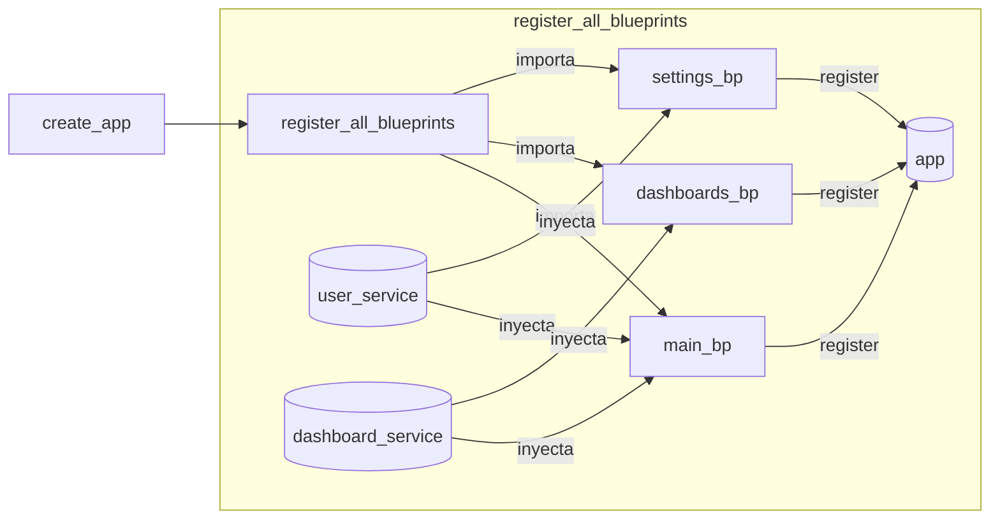
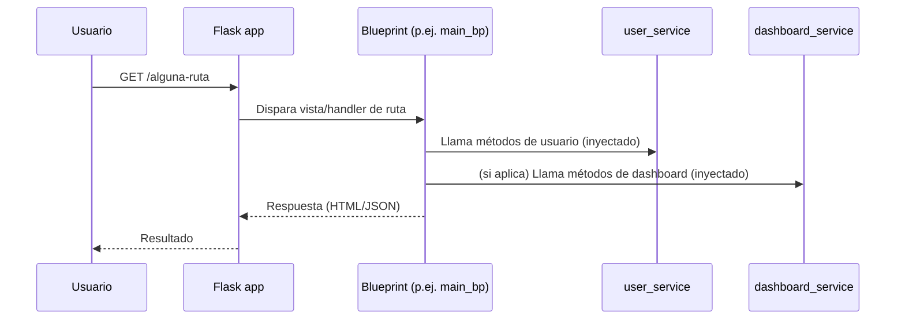

# Documentación funcional — Registro central de Blueprints (`app/api/v1/blueprints.py`)

> Archivo: `app/api/v1/blueprints.py`
> Propósito: **conectar** todas las rutas (blueprints) a la app Flask y **entregarles** los servicios que necesitan.

---

## Introducción

Este módulo ofrece una única función, `register_all_blueprints`, que:

1. **Importa** los blueprints de la aplicación,
2. **Les inyecta** los servicios necesarios (por ejemplo, manejo de usuarios y tablero), y
3. **Los registra** en la aplicación Flask.

¿Por qué es importante?
Porque mantiene en **un solo lugar** el alta de rutas y la entrega de dependencias. Esto hace el proyecto **más ordenado**, fácil de **mantener** y de **probar**.

---

## Uso (paso a paso y ejemplos)

### 1) Uso típico desde la “fábrica” de la app

```python
# app/main.py (ejemplo de uso)
from app.api.v1.blueprints import register_all_blueprints
from app.domain.services.user_service import UserService
from app.domain.services.dashboard_service import DashboardService
from app.infra.db.user_repository_sql import UserRepositorySQL

def create_app(config=settings):
    app = Flask(__name__)
    app.config.from_object(config)

    # ... inicialización de BD, login_manager, etc.

    repo = UserRepositorySQL(schema=app.config.get('DB_SCHEMA', 'public'))
    user_service = UserService(repo)
    dashboard_service = DashboardService(repo)

    # 👉 Aquí centralizamos el registro e inyección
    register_all_blueprints(app, user_service, dashboard_service)
    return app
```

### 2) Agregar un nuevo blueprint (ejemplo práctico)

1. Crea el blueprint:

   ```python
   # app/api/v1/routes/analytics_routes.py
   from flask import Blueprint
   analytics_bp = Blueprint("analytics", __name__, url_prefix="/analytics")
   # (Opcional) atribs para documentar dependencias inyectadas:
   analytics_bp.user_service = None
   ```
2. Regístralo e inyecta lo que necesite:

   ```python
   # app/api/v1/blueprints.py
   from .routes.analytics_routes import analytics_bp
   analytics_bp.user_service = user_service
   app.register_blueprint(analytics_bp)
   ```

> Si un blueprint **no** necesita un servicio, simplemente **no lo inyectes**.

---

## Componentes principales

* **`register_all_blueprints(app, user_service, dashboard_service)`**
  Función que **centraliza**:

  * Importar blueprints (dentro de la función para evitar importaciones circulares).
  * Inyectar servicios como atributos del blueprint.
  * Registrar cada blueprint en la app.

* **Blueprints incluidos**

  * `main_bp`: rutas principales (inicio, menús, etc.).
  * `dashboards_bp`: rutas relacionadas con tableros/paneles.
  * `settings_bp`: rutas para configurar línea/estación.

* **Servicios inyectados**

  * `user_service` → operaciones de usuario (búsqueda, info, validaciones).
  * `dashboard_service` → preparación de datos para tableros.

---

## Visuales (diagramas)

### 1) Flujo del registro central



### 2) Secuencia de una petición (con dependencias ya inyectadas)



> Nota: Las flechas **US/DS → register\_all\_blueprints** en diagramas de arquitectura se interpretan como **“entradas”** a la función (lo que recibe para distribuir). Si dibujas **dependencias**, invierte las flechas: *register\_all\_blueprints* **depende** de esos servicios para inyectarlos.

---

## Consideraciones y buenas prácticas

* **Importación dentro de la función**
  Los `from .routes... import ...` están **dentro** de `register_all_blueprints` para evitar **importaciones circulares** y acelerar tiempos de carga cuando la función no se llama.

* **Inyección por atributos**
  Asignar `blueprint.user_service = ...` es una forma **sencilla** de entregar dependencias. Úsala de forma **consistente** (mismos nombres de atributo).

* **Prefijos y organización**
  Define `url_prefix` en cada blueprint si quieres agrupar rutas (ej. `/dashboard`, `/settings`).

* **Orden de registro**
  Normalmente no importa, pero si compartes manejadores de errores globales vs. locales, el orden puede influir. Mantén un orden **coherente**.

* **Pruebas**
  Este patrón facilita tests: crea “dobles” (mocks/fakes) de `user_service`/`dashboard_service` y llama a `register_all_blueprints` con una app de prueba.

* **Documentación de dependencias**
  Aunque no es obligatorio, declarar en el archivo del blueprint:

  ```python
  analytics_bp.user_service = None  # será inyectado
  ```

  ayuda a **entender** qué espera ese blueprint.

### Limitaciones

* **Atributos dinámicos**
  Si dos extensiones usan el mismo nombre de atributo, puedes sobrescribirlos por error. Mantén **nombres únicos** y claros.

* **Acoplamiento nominal**
  La vista asume que existe `blueprint.user_service`. Si cambias el nombre del atributo o el servicio, actualiza las vistas.

* **Errores por importación**
  Si mueves rutas o cambias nombres de archivos, actualiza las importaciones aquí.

---

## Preguntas frecuentes (FAQ)

**1) ¿Qué es un “blueprint”?**
Un agrupador de rutas. Sirve para organizar el código por módulos (p.ej., `settings`, `dashboard`).

**2) ¿Por qué inyectar servicios así y no importarlos dentro de cada ruta?**
Para **separar responsabilidades**, facilitar **pruebas** y evitar acoplamiento fuerte a detalles de la infraestructura (repositorios, etc.).

**3) ¿Qué pasa si un blueprint no necesita `dashboard_service`?**
Nada: **no lo inyectes**. Inyecta solo lo que use.

**4) ¿Dónde agrego un blueprint nuevo?**
Crea el archivo en `app/api/v1/routes/`, define el `Blueprint`, luego **impórtalo e inyecta** aquí, y finalmente **regístralo** con `app.register_blueprint(...)`.

**5) ¿Puede fallar por importaciones circulares?**
Es menos probable porque importamos **dentro** de la función. Si aun así ocurre, revisa que tus módulos de rutas no importen `create_app` ni `register_all_blueprints`.

**6) ¿Cómo testeo sin tocar la BD real?**
Crea un `user_service` y `dashboard_service` “falsos” (mocks) y pásalos a `register_all_blueprints` con una app de pruebas. Así validas rutas y respuestas sin pegarle a la BD.

**7) ¿Puedo usar otro estilo de inyección (por constructor/fábrica)?**
Sí. Este patrón por atributos es simple; si necesitas **más control**, crea una función fábrica para cada blueprint que reciba sus dependencias y devuelva el `Blueprint` ya configurado.

---

## Checklist rápido

* [ ] ¿El blueprint está importado dentro de `register_all_blueprints`?
* [ ] ¿Inyectaste **solo** los servicios que requiere?
* [ ] ¿Registraste el blueprint con `app.register_blueprint(...)`?
* [ ] ¿Las rutas del blueprint **no** dependen de variables globales?
* [ ] (Opcional) ¿Documentaste en el archivo del blueprint los atributos que esperas inyectar?

---

## Ejemplo completo (fragmento integrado)

```python
# app/api/v1/blueprints.py

def register_all_blueprints(app, user_service, dashboard_service):
    from .routes.main_routes import main_bp
    from .routes.dashboard_routes import dashboards_bp
    from .routes.settings_routes import settings_bp

    # Inyección
    main_bp.user_service = user_service
    main_bp.dashboard_service = dashboard_service

    dashboards_bp.dashboard_service = dashboard_service
    settings_bp.user_service = user_service

    # Registro
    app.register_blueprint(main_bp)
    app.register_blueprint(dashboards_bp)
    app.register_blueprint(settings_bp)
```
