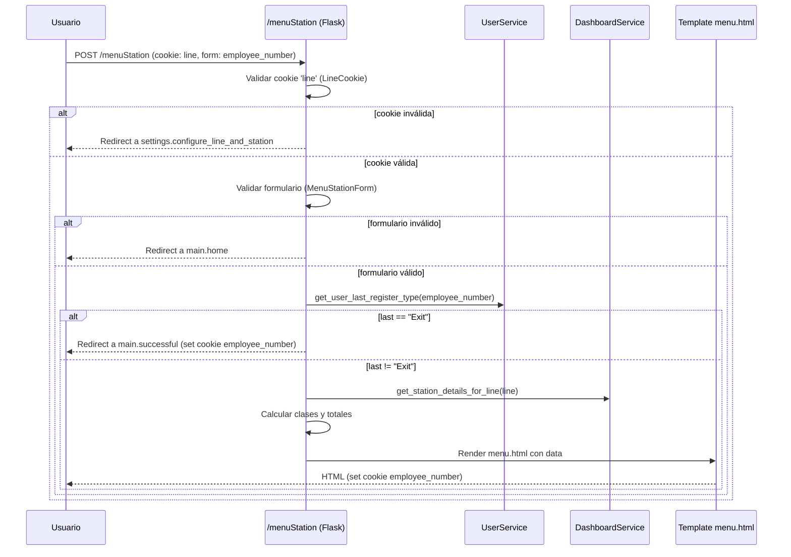
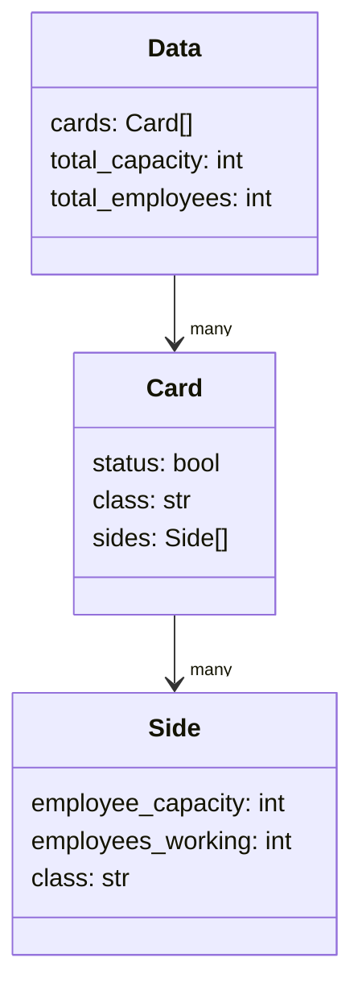

# 📘 Documentación – `menu_station.py` (Menú de Estación por Línea)

## 🟢 Introducción

Este módulo define la ruta `/menuStation` (métodos **GET/POST**) para mostrar un **menú de estación** según la **línea** seleccionada.
Su objetivo es:

* Validar que el usuario tenga una **línea** configurada (cookie `line`).
* Recibir un **formulario** con el número de empleado.
* Consultar la **última acción** del empleado y, si fue “Exit”, llevarlo a una pantalla de éxito.
* Obtener los **detalles de estaciones** de la línea y pintar **estados** (falta/personal justo/exceso) para cada lado y tarjeta.

¿Por qué es importante?
Porque centraliza la lógica de acceso a la información de estaciones por línea y asegura que la UI muestre con claridad si el personal es suficiente, justo o excedente.

---

## 🧪 Uso (con ejemplos)

### 1) Requisito previo: cookie `line`

La cookie `line` debe existir y ser válida. Si no existe o es inválida, el usuario es redirigido a la configuración:

* Si **NO** hay cookie `line` → `redirect` a `settings.configure_line_and_station`.
* Si hay cookie pero es inválida → mismo redirect.

### 2) Flujo GET

* `GET /menuStation` → redirige a `main.home`.
  *(Esta ruta sirve principalmente para manejar el POST del formulario.)*

**Ejemplo con `curl`:**

```bash
curl -i -X GET https://tuapp.com/menuStation --cookie "line=3"
# -> 302 Redirect a /home
```

### 3) Flujo POST

* `POST /menuStation` con datos de formulario (por ejemplo `employee_number`) → valida el formulario, consulta servicios y devuelve la plantilla `menu.html`.

**Ejemplo con `curl`:**

```bash
curl -i -X POST https://tuapp.com/menuStation \
  --cookie "line=3" \
  -d "employee_number=12345"
# -> 302 Redirect a /successful si last == 'Exit'
# -> 200 OK con HTML de menu.html en caso contrario
```

### 4) Resultado esperado en la vista

La plantilla `menu.html` recibirá:

* `cards`: lista de tarjetas (estaciones) con sus lados y clases de estado.
* `total_capacity`: suma de capacidades.
* `total_employees`: suma de personal activo.

---

## 🧩 Componentes principales

1. **Blueprint y registro de ruta**

```python
@bp.route("/menuStation", methods=["GET", "POST"], endpoint="menu_station")
def menu_station(): ...
```

* Registra la ruta `/menuStation` en el *blueprint* provisto.

2. **Validación de la cookie `line`**

```python
line_raw = request.cookies.get("line")
line = LineCookie.model_validate({"line": line_raw}).line
```

* Usa el esquema **`LineCookie`** para validar el valor de la cookie.
* Si falla, redirige a la pantalla de configuración de línea/estación.

3. **Manejo de métodos**

* **GET** → `redirect(url_for("main.home"))`
* **POST** → procesa formulario, consulta servicios y renderiza.

4. **Validación de formulario**

```python
form = MenuStationForm.model_validate(dict(request.form))
```

* Usa **`MenuStationForm`** para validar `employee_number` (y otros campos si existieran).

5. **Lógica de negocio (servicios de dominio)**

* `user_service.get_user_last_register_type(employee_number)`:
  Si devuelve `"Exit"`, se redirige a `main.successful` y se guarda la cookie `employee_number`.
* `dashboard_service.get_station_details_for_line(line)`:
  Devuelve datos de estaciones y lados para la línea.

6. **Cálculo de clases y totales**

```python
def side_status_class(cap, act) -> str:
    if act < cap: return "employee-nook"      # falta (amarillo)
    elif act == cap: return "employee-ok"     # justo (verde)
    else: return "employee-warning"           # excede (rojo)
```

* Para **cada lado**: asigna clase si no venía definida.
* Por **tarjeta** (si `status` no es `False`): agrega clase de fondo:

  * `card--under` (falta), `card--ok` (justo), `card--over` (exceso).
* Acumula `total_capacity` y `total_active`.

7. **Render y cookies**

```python
resp = make_response(render_template("menu.html", **data))
resp.set_cookie("employee_number", str(form.employee_number), httponly=True, samesite="Lax")
```

* Renderiza `menu.html` y setea `employee_number` con flags de seguridad.

---

## 🧷 Visuales (diagramas)

### a) Secuencia de la petición (POST)



### b) Estructura de datos esperada (simplificada)



---

## 🧰 Ejemplo de datos del `DashboardService`

*(Estructura hipotética para entender el render)*

```json
{
  "cards": [
    {
      "status": true,
      "class": "",
      "sides": [
        { "employee_capacity": 3, "employees_working": 2 },
        { "employee_capacity": 2, "employees_working": 2 }
      ]
    },
    {
      "status": true,
      "class": "",
      "sides": [
        { "employee_capacity": 4, "employees_working": 5 }
      ]
    }
  ]
}
```

Tras el cálculo:

* A cada **side** se le asigna `class`:
  `employee-nook` (falta), `employee-ok` (justo) o `employee-warning` (exceso).
* A cada **card** visible se le agrega `class`:
  `card--under`, `card--ok` o `card--over`.
* Se calculan `total_capacity` y `total_employees`.

---

## ⚙️ Consideraciones y requisitos

* **Cookies necesarias**

  * `line` (entrada): requerida para saber qué línea consultar.
  * `employee_number` (salida): se setea al validar el formulario.
  * Flags recomendados: `HttpOnly` y `SameSite=Lax` (ya aplicados).

* **Validaciones**

  * `LineCookie` y `MenuStationForm` usan Pydantic.
    Si fallan, se redirige a rutas seguras (`configure_line_and_station` o `home`) sin romper la app.

* **Estados visuales**

  * **Lado/Side**:

    * `employee-nook` → falta personal (amarillo).
    * `employee-ok` → personal justo (verde).
    * `employee-warning` → exceso de personal (rojo).
  * **Tarjeta/Card**:

    * `card--under`, `card--ok`, `card--over` → fondo según totales por tarjeta.

* **Plantilla `menu.html`**

  * Debe usar las **clases CSS** anteriores para mostrar colores/estados.
  * Debe soportar las claves del contexto (`cards`, `total_capacity`, `total_employees`).

* **Errores comunes**

  * Cookie `line` inexistente/incorrecta → redirección a configuración.
  * Formulario incompleto → redirección a home.
  * `dashboard_service` sin datos o con claves faltantes → asegúrate de que retorne la estructura esperada.

* **Seguridad**

  * No se guardan datos sensibles en la URL.
  * Cookies marcadas como `HttpOnly` y `SameSite=Lax`.
  * Evita imprimir datos de usuario en logs.

---

## ❓ Preguntas frecuentes (FAQ)

**1) ¿Por qué me manda a configurar la línea?**
Porque no existe o no es válida la cookie `line`. Ve a la pantalla de **Configuración de Línea y Estación** y guarda tu selección.

**2) Hice POST y me llevó a “Successful”, ¿es un error?**
No. Si la **última acción** del empleado fue `"Exit"`, el flujo te redirige a `main.successful` y guarda la cookie `employee_number`.

**3) ¿De dónde salen los colores/estados?**
Del cálculo entre **capacidad** (`employee_capacity`) y **activos** (`employees_working`) por lado/tarjeta. El código asigna clases CSS que luego la plantilla pinta con colores.

**4) ¿Qué necesito para que el template funcione?**
Que `menu.html` use las variables del contexto (`cards`, `total_capacity`, `total_employees`) y tenga estilos CSS para las clases:

* `employee-nook`, `employee-ok`, `employee-warning`
* `card--under`, `card--ok`, `card--over`

**5) ¿Qué pasa si el servicio de tablero no retorna `cards`?**
El código tolera `None` y usa una lista vacía, pero no se verán estaciones. Revisa la integración del `DashboardService`.

**6) ¿Puedo cambiar los nombres de clases o colores?**
Sí. Mantén la misma lógica (tres estados) y ajusta CSS/plantilla según tu diseño.

---

## 🧑‍🍳 Guía rápida de integración

1. **Inyecta los servicios** al registrar la ruta:

```python
register_menu_station(bp, user_service, dashboard_service)
```

2. **Asegura el esquema** de datos de `dashboard_service.get_station_details_for_line(line)`:

* Debe incluir `cards` con `sides`, y por cada side: `employee_capacity` y `employees_working`.

3. **Estilos CSS sugeridos** (ejemplo simple):

```css
.employee-nook { background: #FFF3CD; }      /* amarillo suave */
.employee-ok { background: #D1E7DD; }        /* verde suave */
.employee-warning { background: #F8D7DA; }   /* rojo suave */

.card--under { border-left: 6px solid #FFC107; }
.card--ok    { border-left: 6px solid #198754; }
.card--over  { border-left: 6px solid #DC3545; }
```

4. **Plantilla `menu.html`** (fragmento conceptual):

```html
<div class="totales">
  <span>Fuera de estándar: {{ total_capacity }}</span>
  <span>Real: {{ total_employees }}</span>
</div>


  
  <div class="card {{ card.class|default('') }}">
    
      <div class="side {{ side.class|default('') }}">
        Cap: {{ side.employee_capacity }} · Act: {{ side.employees_working }}
      </div>
    
  </div>
  

```

---

## 🧭 Resumen operativo

* **Entrada**: cookie `line` + formulario con `employee_number`.
* **Decisiones**:

  * Si `Exit` → éxito inmediato.
  * Si no, calcular estados y mostrar menú.
* **Salida**: `menu.html` con tarjetas y lados en colores según personal.

¿Quieres que te entregue esta documentación en formato **Markdown listo para Obsidian** (con portada, índice y etiquetas), o la convertimos en un **PDF** con portada y diagramas incrustados?
