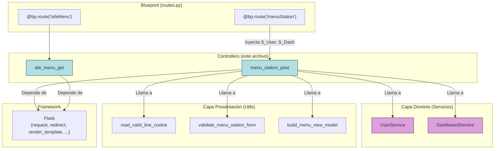

## Documentación Técnica: Controladores de `menu_station` y `afeMenu`

### 1\. Visión General y Propósito del Módulo

#### TL;DR Técnico

Este módulo define la lógica del controlador (el "C" en MVC) para dos endpoints HTTP: `/menuStation` y `/afeMenu`. El controlador `menu_station_post` gestiona el flujo de "inicio de sesión" de un empleado en una estación, orquestando la validación de cookies, la validación de formularios y la lógica de negocio (consultando el último registro del usuario) antes de renderizar la página de menú o redirigir. El controlador `afe_menu_get` es un endpoint simple que devuelve una lista estática de actividades AFE.

#### Contexto Arquitectónico

Este módulo se sitúa en la **Capa de Presentación** (o Capa de Interfaz/API). Su rol principal es:

1.  Traducir las solicitudes HTTP (`request`) en acciones de la aplicación.
2.  Orquestar llamadas a la **Capa de Dominio** (inyectando `UserService` y `DashboardService`) para ejecutar la lógica de negocio.
3.  Delegar tareas auxiliares (validación, cookies, transformación de datos) a otros módulos de la capa de presentación (`validators`, `cookies`, `presenter`).
4.  Formatear la respuesta HTTP, ya sea una redirección (`redirect`) o un `render_template` de una plantilla HTML.

No contiene lógica de negocio en sí mismo; es un coordinador.

#### Justificación de Diseño

1.  **Inyección de Dependencias (DI):** La función `menu_station_post` *no* es un manejador de ruta de Flask directo; es un controlador que *recibe* sus dependencias (`user_service`, `dashboard_service`). Esto es una implementación del principio de Inversión de Dependencias (DIP). Permite que el blueprint que lo invoca (usando `dependency-injector`) inyecte las instancias del servicio, desacoplando este controlador de la creación de objetos y haciéndolo altamente testeable.
2.  **Separación de Responsabilidades (SoC):** El módulo sigue un diseño limpio:
      * **Controlador (este archivo):** Orquesta el flujo.
      * **Validadores (`.validators`):** Manejan la lógica de validación del formulario.
      * **Cookies (`.cookies`):** Abstraen la lógica de lectura/validación de cookies.
      * **Presentador (`.presenter`):** Transforma el modelo de datos del dominio en un ViewModel específico para la plantilla (`menu.html`).
3.  **Contenido Estático (`afe_menu_get`):** La lista de actividades AFE está codificada (hardcodeada). Esta es una decisión de diseño que prioriza la simplicidad y el rendimiento (cero I/O) bajo la suposición de que estos datos son estáticos y cambian con poca frecuencia (requiriendo un redespliegue).

-----

### 2\. Referencia de API y Uso

#### Invocación/ImportACIÓN

Estas funciones no están diseñadas para ser importadas y llamadas por otros módulos de lógica de negocio. Son invocadas por el sistema de enrutamiento de Flask (Blueprints), que es responsable de gestionar el ciclo de vida de la solicitud HTTP y la inyección de dependencias.

#### Métodos Públicos

**`menu_station_post(*, user_service: UserService, dashboard_service: DashboardService) -> Response`**

  * **Propósito:** Orquesta la lógica completa para el endpoint `/menuStation`, que maneja tanto `GET` como `POST`.
  * **Argumentos (Inyectados):**
      * `user_service (UserService)`: Instancia del servicio de dominio para operaciones de usuario.
      * `dashboard_service (DashboardService)`: Instancia del servicio de dominio para operaciones de dashboard/estación.
  * **Lógica de Ejecución (POST):**
    1.  **Validación de Cookie 'line':** Llama a `read_valid_line_cookie()`. Si la cookie no es válida o no existe, retorna una redirección `302` a `settings.configure_line_and_station`.
    2.  **Manejo de GET:** Si `request.method == "GET"`, retorna una redirección `302` a `main.home`.
    3.  **Validación de Formulario:** Llama a `validate_menu_station_form(request.form)`. Si el formulario es inválido, retorna una redirección `302` a `main.home`.
    4.  **Regla de Negocio "Exit":** Llama a `user_service.get_user_last_register_type()` con el `employee_number` del formulario.
    5.  Si el último registro es `"Exit"`, crea una redirección `302` a `main.successful` y establece la cookie `employee_number` antes de retornarla.
    6.  **Flujo Normal:** Si el último registro no es `"Exit"`:
        a.  Obtiene los datos de la estación llamando a `dashboard_service.get_station_details_for_line(line)`.
        b.  Transforma los datos en un ViewModel llamando a `build_menu_view_model(data)`.
        c.  Renderiza la plantilla `menu.html` con el `view_model`.
        d.  Establece la cookie `employee_number` en la respuesta.
        e.  Retorna la respuesta `200 OK` con el HTML.

**`afe_menu_get() -> Response`**

  * **Propósito:** Maneja solicitudes `GET` al endpoint `/afeMenu`.
  * **Argumentos:** Ninguno.
  * **Lógica de Ejecución:**
    1.  Define una lista estática de diccionarios `activities`.
    2.  Obtiene el parámetro de consulta opcional `side_id` de `request.args`.
    3.  Renderiza la plantilla `afe_menu.html`, pasando `activities` y `side_id`.
    4.  Retorna la respuesta `200 OK` con el HTML.

#### Estructuras de Datos

  * **Entrada: `menu_station_post` (Formulario `request.form`)**
    ```typescript
    // Pseudo-TypeScript para request.form
    interface MenuStationForm {
      employee_number: string;
      // ... otros campos de formulario si existen
    }
    ```
  * **Salida: `menu_station_post` (ViewModel para `menu.html`)**
      * El formato es determinado por la salida de `build_menu_view_model`.
  * **Entrada: `afe_menu_get` (Query Params)**
    ```typescript
    // Pseudo-TypeScript para request.args
    interface AfeMenuQuery {
      side_id?: string; // Opcional
    }
    ```
  * **Salida: `afe_menu_get` (Contexto de plantilla para `afe_menu.html`)**
    ```typescript
    // Pseudo-TypeScript para el contexto
    interface Activity {
      id: number;
      name: string;
    }

    interface AfeMenuContext {
      activities: Activity[];
      side_id: string | null;
    }
    ```

#### Ejemplos de Código (Cableado en Blueprint)

Este módulo se utiliza en la capa de enrutamiento (ej. `.../routes.py`) de la siguiente manera:

```python
# En app/api/v1/routes/main/menu_station/routes.py (Archivo hipotético)

from flask import Blueprint
from dependency_injector.wiring import inject, Provide
from app.containers import Container
from . import controllers

# Se asume que este Blueprint está registrado en main.py
bp = Blueprint("menu_station_routes", __name__)

@bp.route("/menuStation", methods=["GET", "POST"])
@inject  # Habilita la inyección de dependencias
def menu_station_route(
    # Solicita los servicios al contenedor
    user_service: UserService = Provide[Container.user_service],
    dashboard_service: DashboardService = Provide[Container.dashboard_service]
):
    """
    Ruta que delega la lógica al controlador, inyectando las dependencias.
    """
    return controllers.menu_station_post(
        user_service=user_service,
        dashboard_service=dashboard_service
    )

@bp.route("/afeMenu", methods=["GET"])
def afe_menu_route():
    """
    Ruta simple que delega directamente al controlador.
    """
    return controllers.afe_menu_get()
```

-----

### 3\. Análisis de Componentes y Diseño Interno

#### Diagrama de Dependencias



  * **Dependencias Duras (importadas):** `Flask`, `.cookies`, `.validators`, `.presenter`.
  * **Dependencias Suaves (inyectadas):** `UserService`, `DashboardService`.

#### Flujo de Control Detallado (`menu_station_post` - Escenario POST Exitoso)

1.  **Solicitud:** `POST /menuStation` con `Content-Type: application/x-www-form-urlencoded` y una cookie `line` válida.
2.  **Enrutamiento:** Flask dirige la solicitud al blueprint, el decorador `@inject` obtiene `user_service` y `dashboard_service` del `Container`.
3.  **Invocación:** Se llama a `menu_station_post(...)` con los servicios inyectados.
4.  **Paso 1:** `read_valid_line_cookie()` se ejecuta. Devuelve el valor de `line` (ej. "L1").
5.  **Paso 2:** `request.method == "GET"` es `False`.
6.  **Paso 3:** `validate_menu_station_form(request.form)` se ejecuta. Asumiendo que `employee_number` está presente y es válido, devuelve un objeto `form` (ej. `Form(employee_number='12345')`).
7.  **Paso 4:** `user_service.get_user_last_register_type('12345')` se ejecuta. El servicio consulta el repositorio.
8.  **Paso 5:** El servicio devuelve un valor, ej. `"Entry"`. La condición `last == "Exit"` es `False`.
9.  **Paso 6:** `dashboard_service.get_station_details_for_line('L1')` se ejecuta. El servicio consulta el repositorio y devuelve una estructura de datos (ej. `StationData(...)`).
10. **Paso 7:** `build_menu_view_model(StationData(...))` se ejecuta. Devuelve un `dict` (el `view_model`) formateado para la plantilla.
11. **Paso 8:** `render_template("menu.html", **view_model)` genera la cadena de texto HTML.
12. **Paso 9:** `make_response(...)` empaqueta el HTML en un objeto `Response`.
13. **Paso 10:** `resp.set_cookie("employee_number", "12345", httponly=True, samesite="Lax")` añade una cabecera `Set-Cookie` a la respuesta.
14. **Retorno:** La `Response` (con código `200 OK`, `Set-Cookie` y cuerpo HTML) se envía al cliente.

#### Consideraciones de Patrones

  * **Controlador (Controller):** El módulo implementa el patrón Controller, actuando como intermediario entre la solicitud HTTP y la lógica de dominio.
  * **Inyección de Dependencias (DI):** Utilizado por `menu_station_post` para recibir servicios (Patrón de Inversión de Control).
  * **Modelo-Vista-Presentador (MVP):** El uso de `build_menu_view_model` es una implementación clara del patrón **Presenter**. El controlador obtiene datos del servicio (el Modelo) y se los pasa al Presentador, que formatea un ViewModel para la Vista (la plantilla HTML).

-----

### 4\. Métricas Clave y Consideraciones Técnicas

#### Limitaciones Conocidas

1.  **Datos Estáticos en `afe_menu_get`:** La lista de `activities` está codificada (hardcodeada). Cualquier cambio en estas actividades requiere una modificación del código y un redespliegue. Esto debería refactorizarse para obtenerse de una capa de servicio (ej. `DashboardService`) si los datos no son verdaderamente estáticos.
2.  **Manejo de Errores de Validación:** El `validate_menu_station_form` simplemente redirige a `main.home` en caso de fallo. Esta es una **mala experiencia de usuario (UX)**, ya que el usuario no recibe retroalimentación sobre *qué* salió mal (ej. "Número de empleado no puede estar vacío"). El flujo debería, idealmente, volver a renderizar la página de inicio (`main.home`) con un mensaje de error (usando `flash`).
3.  **Nombre de Función Confuso:** `menu_station_post` maneja tanto `GET` como `POST`, lo que hace que su nombre sea engañoso. La lógica `GET` es trivial (solo redirección), pero aun así está presente.

#### Requisitos y Entorno

  * **Framework:** Flask (requerido para `request`, `redirect`, `render_template`, etc.).
  * **Inyección de Dependencias:** `dependency-injector` (implícito, necesario para el cableado de `menu_station_post`).
  * **Variables de Entorno:** Este módulo no consume variables de entorno directamente, pero los servicios que utiliza (para conexiones de BD) sí las requerirán.
  * **Estado del Cliente:** La aplicación depende de que el cliente acepte cookies, específicamente la cookie `line` (como prerrequisito) y `employee_number` (que se establece aquí).

#### Consideraciones de Rendimiento/Escalabilidad

  * **`afe_menu_get`:** Rendimiento excelente. Es O(1), no realiza I/O y solo renderiza una plantilla estática. Altamente escalable.
  * **`menu_station_post`:** El rendimiento está directamente ligado al de los servicios que consume. Realiza hasta dos llamadas de servicio que pueden implicar I/O (Base de Datos):
    1.  `user_service.get_user_last_register_type(...)`
    2.  `dashboard_service.get_station_details_for_line(...)`
        La latencia de este endpoint será la suma de la latencia de estas dos llamadas (si ambas ocurren). La escalabilidad está limitada por la capacidad de la base de datos subyacente.

-----

### 5\. Desarrollo y Mantenimiento

#### Proceso de Pruebas

Debido al acoplamiento con el contexto global de Flask (`request`, `make_response`), las pruebas unitarias de este módulo son complejas. Se recomienda encarecidamente realizar **pruebas de integración** utilizando el `test_client` de Flask.

1.  **Configuración de Pruebas:**

      * Cree una instancia de la aplicación Flask en modo de prueba (`app = create_app(TestConfig)`).
      * Obtenga el `test_client` (`client = app.test_client()`).
      * Utilice el contenedor de la aplicación para **sobrescribir (override)** los servicios inyectados con *mocks*.

2.  **Ejemplo de `pytest`:**

    ```python
    import pytest
    from unittest.mock import MagicMock

    # Asumiendo una fixture 'app' que crea la app de prueba
    @pytest.fixture
    def client_with_mocks(app):
        # Crear mocks para los servicios
        mock_user_service = MagicMock(spec=UserService)
        mock_dash_service = MagicMock(spec=DashboardService)
        
        # Usar el contenedor de la app para sobrescribir las dependencias
        with app.container.user_service.override(mock_user_service), \
             app.container.dashboard_service.override(mock_dash_service):
            
            client = app.test_client()
            # Inyectar los mocks en la fixture para que los tests los configuren
            client.mock_user_service = mock_user_service
            client.mock_dash_service = mock_dash_service
            yield client

    def test_menu_station_post_no_line_cookie(client_with_mocks):
        # Arrange
        # El cliente no tiene cookies
        
        # Act
        response = client_with_mocks.post("/menuStation", data={"employee_number": "123"})
        
        # Assert
        assert response.status_code == 302
        assert response.location == "/settings/configureLineAndStation" # O la URL generada por url_for()

    def test_menu_station_post_last_register_exit(client_with_mocks):
        # Arrange
        client_with_mocks.set_cookie("line", "L1")
        client_with_mocks.mock_user_service.get_user_last_register_type.return_value = "Exit"
        
        # Act
        response = client_with_mocks.post("/menuStation", data={"employee_number": "123"})
        
        # Assert
        assert response.status_code == 302
        assert response.location == "/main/successful" # O la URL generada
        client_with_mocks.mock_user_service.get_user_last_register_type.assert_called_with("123")
        
        # Verificar que la cookie 'employee_number' fue establecida
        assert "employee_number=123" in response.headers.get('Set-Cookie')
    ```

#### Guía de Contribución

  * **Para añadir una nueva regla de negocio (ej. "si el último registro es `Break`"):** Modifique el flujo de control en `menu_station_post` después de la llamada a `user_service.get_user_last_register_type()`.
  * **Para cambiar las actividades AFE:** Edite la lista `activities` en `afe_menu_get`. Si esto se vuelve dinámico, refactorice para inyectar `DashboardService` y obtener los datos de él.
  * **Para mejorar la validación:** Modifique `app/api/v1/routes/main/menu_station/validators.py`. Para mostrar mensajes de error, refactorice `menu_station_post` para que no redirija en `form is None`, sino que use `flash()` y vuelva a renderizar la plantilla `main/home.html`.

#### Notas de Depuración (Debugging)

  * **Punto de entrada:** Los `print` existentes (`print("En menu_station/controllers.py...")`) son útiles para verificar los datos del formulario recibido.
  * **Redirección a `/main/home`:** Si es redirigido inesperadamente a *home*, significa una de dos cosas: (1) Su solicitud fue `GET` (potencialmente un formulario mal configurado `method="GET"`), o (2) `validate_menu_station_form` falló. Verifique los `name` de los campos `input` en su plantilla HTML.
  * **Redirección a `/settings/configureLineAndStation`:** Esto significa que la cookie `line` falta o es inválida. Verifique el flujo de inicio de sesión anterior que establece esta cookie.
  * **Error `AttributeError: 'NoneType' object has no attribute ...`:** Esto puede ocurrir si `validate_menu_station_form` devuelve `None` y el código intenta acceder a `form.employee_number`. El `print` existente ayuda a detectar esto.