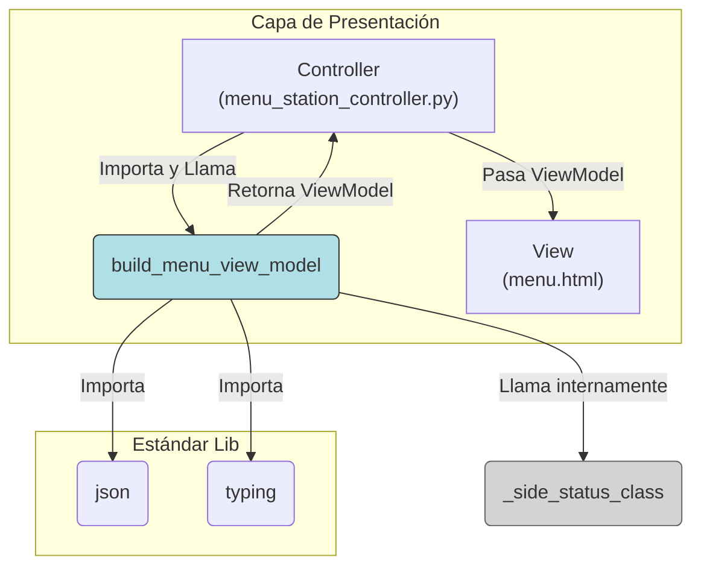

## Documentación Técnica: Presentador de `menu_station`

### 1\. Visión General y Propósito del Módulo

#### TL;DR Técnico

Este módulo es un **Presentador** puro. Su única función (`build_menu_view_model`) es transformar una estructura de datos cruda (recibida del servicio) en un **ViewModel** enriquecido, listo para ser renderizado por la plantilla `menu.html`. El proceso de transformación incluye agregar lógica de presentación (clases CSS) y calcular agregados (totales de personal) que la vista requiere.

#### Contexto Arquitectónico

Este módulo reside en la **Capa de Presentación (Interfaz)**, sirviendo como un componente "Presentador" en un patrón Model-View-Presenter (MVP) o Model-View-ViewModel (MVVM).

  * **Entrada:** Recibe datos crudos del **Controlador** (que a su vez los obtuvo de los servicios de dominio).
  * **Salida:** Devuelve un ViewModel al **Controlador**, que luego lo pasa a la **Vista** (plantilla Jinja2 `menu.html`).

Su propósito es desacoplar la lógica de *preparación de datos para la vista* (que es volátil y específica de la UI) de la lógica del controlador (que orquesta el flujo) y de la vista (que solo debe renderizar datos).

#### Justificación de Diseño

1.  **Patrón Presenter/ViewModel:** Se adopta este patrón para mantener los controladores "delgados" (thin controllers) y las vistas "tontas" (dumb views). Toda la lógica de UI (ej. "si `activos < capacidad` entonces la clase es `employee-nook`") se centraliza aquí.
2.  **Centralización de Reglas de UI:** Las constantes de CSS (`EMPLOYEE_NOK`, `EMPLOYEE_OK`, `EMPLOYEE_WRN`) están co-ubicadas con la lógica que las usa. Esto facilita la modificación de la lógica de estado visual sin tener que buscarla en los controladores o en la plantilla.
3.  **Inmutabilidad (Parcial):** La función `build_menu_view_model` opera sobre una copia superficial (`dict(raw_data or {})`) de los datos de entrada, previniendo la mutación accidental del estado original proveniente de los servicios. Sin embargo, *muta* esta copia superficial extensivamente.
4.  **Testabilidad:** Al ser una función pura (sin I/O, sin estado, sin dependencias de framework), este módulo es 100% testeable unitariamente, permitiendo una validación robusta de la lógica de la UI.

-----

### 2\. Referencia de API y Uso

#### Invocación/Importación

Este módulo no está diseñado para ser instanciado. Su función pública se importa y se llama directamente desde la capa de controlador.

**Invocación Típica (Desde un Controlador):**

```python
# En app/api/v1/routes/main/menu_station/controllers.py
from app.domain.services.dashboard_service import DashboardService
from .presenter import build_menu_view_model

def menu_station_post(dashboard_service: DashboardService):
    # ...
    # 1. Obtener datos crudos del servicio
    raw_station_data = dashboard_service.get_station_details_for_line(line)
    
    # 2. Transformar datos crudos en ViewModel
    view_model = build_menu_view_model(raw_station_data)
    
    # 3. Renderizar la vista con el ViewModel
    return render_template("menu.html", **view_model)
```

#### Métodos Públicos

**`build_menu_view_model(raw_data: Dict[str, Any]) -> Dict[str, Any]`**

  * **Propósito:** Transforma el diccionario de datos crudos en un ViewModel listo para la plantilla `menu.html`.
  * **Argumentos:**
      * `raw_data (Dict[str, Any])`: El diccionario de datos (generalmente un JSON serializado) proveniente del `DashboardService`.
  * **Retorna:** `Dict[str, Any]`. Un nuevo diccionario (copia superficial del original) que contiene:
    1.  Todos los pares clave/valor originales.
    2.  Claves *añadidas/sobrescritas*: `total_capacity`, `total_employees`.
    3.  Una clave `cards` *mutada*, donde cada `side` dentro de cada `card` ahora tiene una clave `class`.
  * **Lógica de Transformación:**
    1.  Calcula los totales `total_capacity` (capacidad estándar) y `total_employees` (personal activo) iterando sobre todas las `cards` y sus `sides`.
    2.  Para cada `side` individual, calcula su clase CSS de estado (`employee-nook`, `employee-ok`, `employee-warning`) llamando a `_side_status_class`.
    3.  Añade esta clase al diccionario `side` usando `side.setdefault("class", ...)`. Esto es clave: **no sobrescribirá** una clave `class` si esta ya venía en los `raw_data`, permitiendo anulaciones manuales.
    4.  Aplica clases CSS adicionales (`card--under`, `card--ok`, `card--over`) a las `cards` que están explícitamente marcadas con `status: False`.
    5.  Actualiza el diccionario principal con los totales calculados y la lista de `cards` mutada.

#### Estructuras de Datos

**Entrada: `raw_data` (Pseudo-TypeScript)**

```typescript
interface RawData {
  line: string;
  tipo: string;
  cards: Card[];
  // ...otras claves que se pasan sin modificar
}

interface Card {
  position_name: string;
  status?: boolean; // Default True. Si es False, se aplica lógica de clase extra
  class?: string;   // Clase CSS base
  sides: Side[];
}

interface Side {
  side_id: string | number;
  side_title: string;
  employee_capacity: number | string; // Se convierte a int
  employees_working: number | string; // Se convierte a int
  class?: string; // Opcional: si se provee, anula la lógica de _side_status_class
}
```

**Salida: `ViewModel` (Pseudo-TypeScript)**

```typescript
interface ViewModel {
  line: string;
  tipo: string;
  cards: CardViewModel[];
  total_capacity: number; // Total calculado de employee_capacity
  total_employees: number; // Total calculado de employees_working
  // ...otras claves
}

interface CardViewModel {
  position_name: string;
  status?: boolean;
  class: string; // Clase CSS base + clase calculada (ej. "card--under")
  sides: SideViewModel[];
}

interface SideViewModel {
  side_id: string | number;
  side_title: string;
  employee_capacity: number;
  employees_working: number;
  class: string; // Clase CSS calculada (ej. "employee-nook") o la original
}
```

-----

### 3\. Análisis de Componentes y Diseño Interno

#### Diagrama de Dependencias



  * **Dependencias Duras:** `json`, `typing`.
  * **Dependencias de Módulo:** Ninguna. Es un módulo hoja (leaf module) sin dependencias a otros componentes de la aplicación (servicios, repositorios, etc.), lo que lo hace idealmente desacoplado.

#### Flujo de Control Detallado (`build_menu_view_model`)

1.  **Entrada:** Recibe `raw_data`.
2.  **Protección/Copia:** `data = dict(raw_data or {})`. Si `raw_data` es `None`, `data` se convierte en `{}`. De lo contrario, `data` es una copia superficial.
3.  **Debug:** Imprime el `data` en la consola (vía `json.dumps`).
4.  **Inicialización:** `cards = data.get("cards", [])`, `total_capacity = 0`, `total_active = 0`.
5.  **Loop 1 (Card):** Itera sobre cada `card` en la lista `cards`.
    1.  **Inicialización (Card):** `card_cap = 0`, `card_act = 0`.
    2.  **Loop 2 (Side):** Itera sobre cada `side` en `card.get("sides", [])`.
        1.  **Extracción:** Obtiene `cap` y `act`, convirtiéndolos a `int` (con `0` como *default*).
        2.  **Agregación (Card):** `card_cap += cap`, `card_act += act`.
        3.  **Lógica de Clase (Side):** Llama a `_side_status_class(cap, act)` (ej. retorna `EMPLOYEE_NOK`).
        4.  **Mutación (Side):** `side.setdefault("class", "employee-nook")`. Si `side` ya tenía una clave `"class"`, esta línea no hace nada.
    3.  **Lógica de Clase (Card):**
        1.  Verifica `if not card.get("status", True)` (es decir, si `status` está presente y es `False`).
        2.  Si es `False`, construye una clase CSS compuesta (ej. `base_class card--under`) y *sobrescribe* `card["class"]`.
    4.  **Agregación (Total):** `total_capacity += card_cap`, `total_active += card_act`.
6.  **Mutación (Data):** `data.update(...)` sobrescribe `cards` con la lista mutada, y añade/sobrescribe `total_capacity` y `total_employees` (usando el valor de `total_active`).
7.  **Retorno:** Devuelve el diccionario `data` mutado.

#### Consideraciones de Patrones

  * **Presenter (o ViewModel Builder):** El propósito fundamental del módulo. Separa la lógica de preparación de la vista.
  * **Strategy (Miniatura):** La función `_side_status_class` es una implementación del Patrón Estrategia. Encapsula el algoritmo (la "estrategia") para determinar el estado visual de un `side`. Si las reglas cambiaran (ej. "usar 5 niveles de color"), solo esta función necesitaría cambiar.

-----

### 4\. Métricas Clave y Consideraciones Técnicas

#### Limitaciones Conocidas

1.  **Acoplamiento Fuerte a CSS:** Las constantes `EMPLOYEE_NOK`, `EMPLOYEE_OK`, `EMPLOYEE_WRN` están codificadas. Si el equipo de *frontend* decide renombrar las clases en `styles.css`, este archivo Python **debe** modificarse. Esto es un acoplamiento inevitable en este patrón, pero debe ser documentado.
2.  **Lógica `status: False` Cuestionable:** La lógica que añade clases `card--...` *solo* si `status` es `False` es contraintuitiva. La plantilla `menu.html` *oculta* la tarjeta si `status` es `False` (` hidden `). Por lo tanto, este código está aplicando lógica de estilo a un elemento que está (`display: none` o similar). Esto podría ser código muerto o un remanente de un requisito anterior.
3.  **`print` Statement:** El `print(json.dumps(data, ...))` debe eliminarse antes de pasar a producción. Genera un I/O de consola costoso y ruidoso en cada renderizado de menú.
4.  **Conversión de Tipo Implícita:** El código asume que `employee_capacity` y `employees_working` pueden ser cadenas (`int(side.get(..., 0))`). Esto es robusto, pero oculta potenciales problemas de tipo de datos si el servicio *debería* estar garantizando números.

#### Requisitos y Entorno

  * **Python:** 3.7+ (implícito por el uso de `__future__annotations` y `typing`).
  * **Librerías Estándar:** `json`, `typing`.
  * **Dependencias Externas:** Ninguna.

#### Consideraciones de Rendimiento/Escalabilidad

  * **Complejidad:** El algoritmo es O(N\*M) donde N es el número de `cards` y M es el número promedio de `sides` por `card`.
  * **Rendimiento:** Extremadamente rápido. Dado que N y M son números pequeños (ej. N=10, M=4), el costo computacional es trivial (decenas de microsegundos).
  * **Cuello de botella:** Este módulo es puramente computacional (CPU-bound) y **no será** un cuello de botella de rendimiento. Cualquier latencia en la carga de la página provendrá del I/O de la base de datos en los servicios que proporcionan los `raw_data`.

-----

### 5\. Desarrollo y Mantenimiento

#### Proceso de Pruebas

Este módulo es un candidato ideal para **Pruebas Unitarias** (`pytest`). No se requieren *mocks* (excepto los datos de entrada), ni `test_client` de Flask, ni contexto de aplicación.

**Estrategia de Pruebas Unitarias (`tests/test_presenter.py`):**

1.  **Probar `_side_status_class`:**
      * `assert _side_status_class(5, 4) == EMPLOYEE_NOK`
      * `assert _side_status_class(5, 5) == EMPLOYEE_OK`
      * `assert _side_status_class(5, 6) == EMPLOYEE_WRN`
2.  **Probar `build_menu_view_model` (Caso base):**
      * Pasar `None` y `{}`. Asegurar que retorna `{"cards": [], "total_capacity": 0, "total_employees": 0}`.
3.  **Probar `build_menu_view_model` (Cálculo de Totales):**
      * Pasar datos de prueba con múltiples `cards` y `sides`.
      * `result = build_menu_view_model(mock_data)`
      * `assert result["total_capacity"] == <valor_esperado>`
      * `assert result["total_employees"] == <valor_esperado>`
4.  **Probar `build_menu_view_model` (Inyección de Clase):**
      * Pasar datos de prueba.
      * `assert result["cards"][0]["sides"][0]["class"] == EMPLOYEE_OK` (o el que corresponda).
5.  **Probar `build_menu_view_model` (Anulación de Clase):**
      * Pasar datos de prueba donde un `side` ya tiene `{"class": "mi-clase-especial"}`.
      * `assert result["cards"][0]["sides"][0]["class"] == "mi-clase-especial"` (para probar `setdefault`).
6.  **Probar `build_menu_view_model` (Lógica de `status: False`):**
      * Pasar un `card` con `{"status": False, "sides": [...]}`.
      * Asegurar que `result["cards"][0]["class"]` contiene la clase `card--...` esperada.

#### Guía de Contribución

  * **Para cambiar los colores/clases (ej. `employee-nook` debe ser `text-danger`):**
    1.  Modifique las constantes `EMPLOYEE_NOK`, `EMPLOYEE_OK`, `EMPLOYEE_WRN` al inicio del archivo.
  * **Para cambiar la lógica de cálculo de clase (ej. "rojo" si `act > cap + 2`):**
    1.  Modifique la lógica *interna* de la función `_side_status_class`.
  * **Para añadir un nuevo agregado (ej. `total_stations`):**
    1.  En `build_menu_view_model`, inicialice `total_stations = 0`.
    2.  Dentro del `for card in cards:`, incremente el contador (ej. `total_stations += 1`).
    3.  Añada `"total_stations": total_stations` al diccionario `data.update(...)` al final.

#### Notas de Depuración (Debugging)

  * **El `print()` es tu amigo:** El `print(json.dumps(data, ...))` existente es la herramienta principal. Muestra los *datos de entrada* (después de la copia). Si los datos se ven mal aquí, el problema está *antes* de este módulo (en el servicio o controlador).
  * **Clase CSS incorrecta en un `side`:**
    1.  Verifique los `raw_data`. ¿Ese `side` venía con una clave `class` predefinida? Si es así, `setdefault` la respetará, ignorando la lógica de `_side_status_class`.
    2.  Verifique la lógica en `_side_status_class`.
  * **Totales incorrectos:**
    1.  Verifique los `raw_data`. Asegúrese de que `employee_capacity` y `employees_working` sean numéricos o cadenas de números. Si son `None` o alfanuméricos, `int(side.get(..., 0))` los convertirá en `0`, llevando a un total incorrecto.