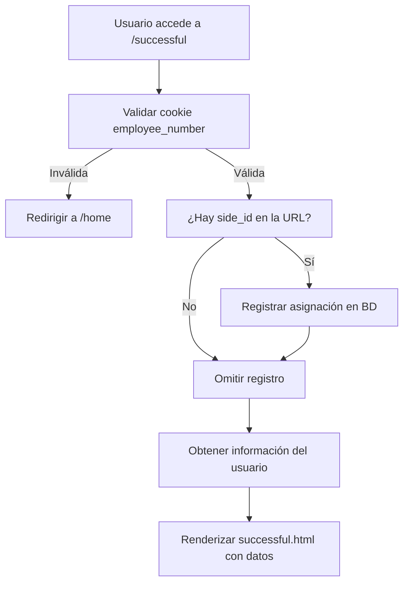

# 📖 Documentación del módulo `/successful`

## 📝 Introducción

Este código define una **página de éxito** dentro de una aplicación web.
Su propósito es mostrar información de un usuario después de que se haya identificado o registrado correctamente.

Es importante porque:

* Valida la identidad del usuario mediante una **cookie**.
* Guarda información sobre su **asignación a una estación** (cuando corresponde).
* Muestra una **pantalla de confirmación amigable** al usuario.

---

## ▶️ Uso

Cuando un usuario accede a la URL:

```
GET /successful
```

El sistema:

1. Revisa la cookie `employee_number` para identificar al usuario.
2. Si la URL incluye un parámetro `id` (ejemplo: `/successful?id=12`), lo guarda como asignación en la base de datos.
3. Recupera los datos del usuario (nombre e imagen).
4. Muestra la página `successful.html` con su información.

### Ejemplo práctico

* El usuario inicia sesión y es dirigido automáticamente a `/successful`.
* El sistema valida su identidad y muestra:

```
Bienvenido, Juan Pérez 🎉
[Foto del usuario]
```

---

## 🧩 Componentes principales

### 1. `register_successful(bp, user_service)`

* Función principal que **registra la ruta `/successful`** en el sistema.
* Conecta la lógica de negocio con la interfaz web.

### 2. Validación de cookie (`employee_number`)

* Garantiza que cada usuario esté identificado antes de entrar.
* Si no es válida, redirige a la página de inicio (`/home`).

### 3. Registro de asignación (`side_id`)

* Si la URL incluye un `id` (ejemplo: estación o máquina), guarda la asignación en la base de datos mediante `user_service`.

### 4. Obtención de datos del usuario

* Usa `user_service.get_user_info_for_display()` para recuperar el nombre y el ID del usuario.

### 5. Renderizado de la plantilla

* Muestra `successful.html` junto con:

  * **Nombre del usuario**.
  * **Imagen** personalizada.
  * **Hoja de estilos** (`styles.css`).

---

## ⚠️ Consideraciones

* **Dependencias:**

  * Necesita `Flask` para manejar rutas y plantillas.
  * Depende del servicio `UserService` para consultar y registrar información de usuarios.
  * Requiere la clase `EmployeeCookie` para validar cookies.

* **Limitaciones:**

  * Si la cookie no está configurada correctamente, el usuario será redirigido a `/home`.
  * Si ocurre un error en el registro de asignación, también se redirige a `/home`.

* **Archivos externos necesarios:**

  * Plantilla HTML: `successful.html`
  * Hoja de estilos: `static/css/styles.css`
  * Imagen del usuario: `static/img/media/{id}.png`

---

## 📊 Visual del flujo



---

## ❓ Preguntas Frecuentes (FAQ)

**1. ¿Qué pasa si no tengo la cookie `employee_number`?**
👉 Serás redirigido automáticamente a la página de inicio (`/home`).

**2. ¿Es obligatorio enviar `id` en la URL?**
👉 No. El `id` solo es necesario si quieres registrar la asignación del usuario a un lugar específico (ej. una estación).

**3. ¿Dónde se guardan los datos de usuario?**
👉 En la base de datos, mediante el servicio `UserService`.

**4. ¿Qué ocurre si hay un error al registrar la asignación?**
👉 El sistema muestra un mensaje en consola y redirige a `/home`, para evitar fallos visibles al usuario.

**5. ¿Cómo se muestra la foto del usuario?**
👉 Se busca en la carpeta `static/img/media/` un archivo con el nombre `{id}.png`.

---

👉 Con esta documentación, incluso alguien sin experiencia técnica puede entender **qué hace el código, cómo usarlo y qué esperar de él**.

¿Quieres que también prepare un **README breve** para desarrolladores (más técnico), complementario a esta documentación de usuario final?
