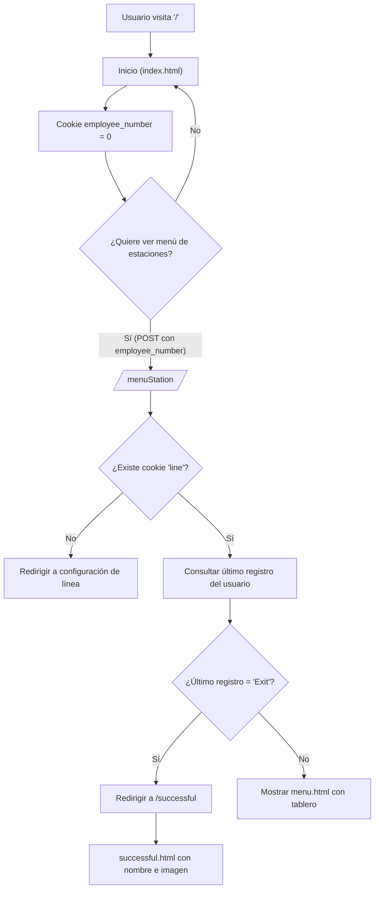
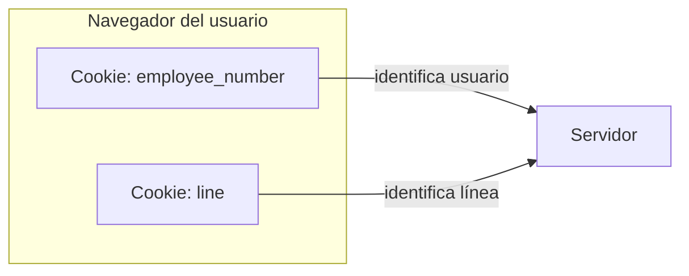

# Documentación funcional — Rutas principales (`main_routes.py`)

> Archivo: `src/app/api/v1/routes/main_routes.py`
> Framework: Flask (aplicaciones web en Python)

---

## Introducción

Este módulo define las **rutas principales** de una aplicación web. Su objetivo es:

* Mostrar la **página de inicio**.
* Gestionar una **página de éxito** con información del usuario.
* Mostrar un **menú de estaciones** según la línea seleccionada.

¿Por qué es importante?
Centraliza el flujo inicial de la app: establece pequeñas “notas” en el navegador (cookies) para recordar al usuario y su línea de trabajo, obtiene datos básicos del usuario y prepara un tablero para la estación seleccionada.

---

## Uso (paso a paso, sin tecnicismos)

### 1) Entrar a la app

1. Visita la URL raíz `/`.
2. La app carga la página **Inicio** (`index.html`) y guarda una nota interna llamada **employee\_number** con el valor `0`.

   > Esto no es visible para ti; es un dato guardado en tu navegador.

### 2) Seleccionar línea y estación (previo)

* En otra sección de la app (no incluida aquí) se configura la **línea**; al hacerlo se guarda una nota interna llamada **line**.
* Si no existe esta línea guardada, el sistema te mandará a la página de **configuración** para que la selecciones.

### 3) Abrir el menú de estaciones

1. Envía tu **número de empleado** desde un formulario hacia `/menuStation`.
2. La app revisa tu **último tipo de registro**:

   * Si fue **“Exit”** (salida), **te redirige a la página de éxito**.
   * Si no, **muestra el menú de estaciones** (`menu.html`) con datos del tablero para la línea guardada.
3. La app actualiza la nota interna **employee\_number** con el valor que enviaste.

### 4) Ver la página de éxito

* Al visitar `/successful`, la app:

  * Lee tu **employee\_number** guardado.
  * Obtiene tu **nombre** e **imagen** y los muestra en `successful.html`.

---

## Componentes principales

* **Blueprint `main_bp`**
  “Agrupador” de rutas. Permite organizar mejor la aplicación.

* **Servicios de dominio**

  * `UserService`

    * `get_user_info_for_display(employee_number)`: Devuelve datos del usuario (por ejemplo, `name` e `id`).
    * `get_user_last_register_type(employee_number)`: Devuelve el último tipo de registro del usuario (por ejemplo, “Exit”).
  * `DashboardService`

    * `prepare_station_dashboard(line_id)`: Prepara los **datos del tablero** que se muestran en el menú de estaciones.

* **Rutas**

  * `GET /` → **Inicio**

    * Pone `employee_number = "0"` en una cookie.
    * Renderiza `index.html` (usa `static/css/init_styles.css`).
  * `GET /successful` → **Página de éxito**

    * Lee `employee_number` de la cookie.
    * Muestra `successful.html` con `name` e imagen `static/img/media/{id}.png`.
  * `GET|POST /menuStation` → **Menú de estaciones**

    * Requiere cookie `line` (si no existe, te manda a configurar).
    * Toma `employee_number` del formulario (si falta, regresa a `/`).
    * Si el **último registro** del usuario es “Exit”, redirige a `/successful`.
    * Si no, renderiza `menu.html` con el tablero de la línea.

---

## Visuales (diagramas)

### 1) Flujo de navegación

### 2) Datos guardados en el navegador (cookies)

---

## Consideraciones y requisitos

* **Requisitos previos**

  * La app debe estar ejecutándose (por ejemplo, con Flask).
  * Deben existir las **plantillas**: `index.html`, `successful.html`, `menu.html`.
  * Deben existir los **archivos estáticos** usados en las plantillas:

    * CSS: `static/css/init_styles.css`, `static/css/styles.css`
    * Imágenes de usuario: `static/img/media/{id}.png`
  * Deben estar implementados los **servicios** `UserService` y `DashboardService`.

* **Cookies necesarias**

  * `employee_number`: se crea en `/` y se actualiza en `/menuStation`.
  * `line`: se establece en la pantalla de **configuración de línea** (otra ruta).
    Si falta, `/menuStation` redirige a configurarla.

* **Redirecciones esperadas**

  * Sin `line` → redirección a configuración.
  * Sin `employee_number` en el formulario → redirección a `/`.
  * Con último registro = “Exit” → redirección a `/successful`.

* **Limitaciones**

  * Si la imagen `static/img/media/{id}.png` no existe, la página de éxito no podrá mostrar la foto.
  * Si los servicios no devuelven datos válidos (por ejemplo, `name` o `id`), las plantillas no se renderizarán correctamente.
  * El flujo de `/menuStation` depende de un **formulario** que envía `employee_number`. Un acceso directo por URL sin enviarlo te regresará a `/`.

* **Seguridad básica**

  * Las cookies pueden ser manipuladas por usuarios avanzados. Para escenarios reales, considera:

    * Validar en servidor que `employee_number` y `line` existan y sean válidos.
    * Usar cookies seguras (por ejemplo, **HttpOnly**, **Secure**) y sesiones.

---

## Preguntas frecuentes (FAQ)

**1) ¿Qué es una “cookie”?**
Es una pequeña nota que la app guarda en tu navegador para recordar datos simples (por ejemplo, tu número de empleado o la línea seleccionada).

**2) ¿Por qué me manda a configurar la línea?**
Porque el menú de estaciones usa tu **línea** para preparar el tablero. Si la app no sabe cuál es, te pide definirla primero.

**3) ¿Por qué me redirige a la página de éxito?**
Si tu último registro (según el sistema) fue **“Exit”**, el flujo considera que ya terminaste tu actividad y te muestra la página de éxito.

**4) No veo mi foto en la página de éxito. ¿Qué falta?**
La imagen debe estar en `static/img/media/{id}.png`, donde `{id}` es el que devuelve `UserService`. Verifica que ese archivo exista.

**5) Entré directo a `/menuStation` y me regresó a inicio.**
Necesitas enviar tu **número de empleado** desde un formulario. Si no llega, la app te devuelve a `/` para empezar correctamente.

**6) ¿Puedo cambiar el estilo visual?**
Sí. Los estilos se cargan desde `static/css/*.css`. Puedes modificar esos archivos o la plantilla HTML para ajustar el diseño.

---

## Guía rápida de prueba (sin detalles técnicos)

1. Abre `/` → ¿ves la pantalla de inicio?
2. Configura tu **línea** (en la sección correspondiente).
3. Desde un formulario, envía tu **número de empleado** a `/menuStation`.
4. Si tu último registro es distinto de “Exit”, deberías ver el **menú de estaciones**.
5. Si tu último registro es “Exit”, serás redirigido a **/successful** y verás tu nombre e imagen.

---

## Glosario breve

* **Ruta**: Dirección específica dentro de la app (por ejemplo, `/successful`).
* **Plantilla**: Archivo HTML que se rellena con datos para mostrar la página.
* **Servicio**: Componente que obtiene o prepara información (usuario, tablero, etc.).
* **Redirección**: Cuando la app te envía automáticamente a otra ruta.

---

## Mantenimiento y puntos de extensión

* Si cambias los nombres de archivos (`.html`, `.css`, imágenes), actualiza las rutas en el código.
* Para añadir validaciones extra (por ejemplo, formatos de `employee_number`), hazlo en `UserService` o en la ruta antes de renderizar la plantilla.
* Si el tablero crece, considera separar más la preparación de datos en `DashboardService`.
