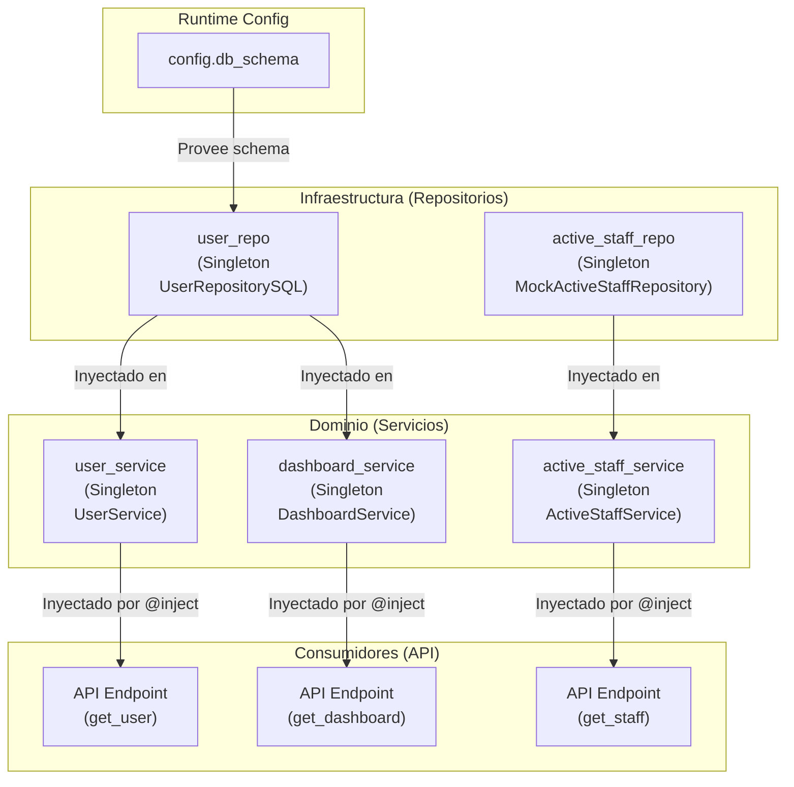

## Documentación Técnica: Módulo de Contenedor de Dependencias (`app/containers.py`)

### 1\. Visión General y Propósito del Módulo

#### TL;DR Técnico

Este módulo define el contenedor central de Inyección de Dependencias (DI) de la aplicación utilizando `dependency-injector`. Actúa como la "Raíz de Composición" (`Composition Root`), declarando las recetas para instanciar y "cablear" (wire) los servicios de dominio (`UserService`, etc.) con sus implementaciones concretas de infraestructura (`UserRepositorySQL`, etc.). Expone todos los componentes principales como **Singletons**.

#### Contexto Arquitectónico

Este módulo es una pieza fundamental de la **Capa de Infraestructura y Composición** de la aplicación. No contiene lógica de negocio. Su único propósito es implementar el principio de Inversión de Dependencias (DIP) de SOLID.

Desacopla la **Capa de Dominio** (que define *qué* hacer, ej: `UserService`) de la **Capa de Infraestructura** (que define *cómo* hacerlo, ej: `UserRepositorySQL`). La aplicación principal (la fábrica de Flask en `app/main.py`) utiliza este contenedor para obtener instancias de servicios sin necesidad de conocer cómo se construyen o cuáles son sus dependencias internas.

#### Justificación de Diseño

1.  **Inyección de Dependencias (DI):** Se adopta este patrón para eliminar el acoplamiento fuerte entre los componentes. Los servicios no instancian sus propios repositorios; en su lugar, los reciben en su constructor, permitiendo que las implementaciones sean intercambiadas fácilmente (ej., por *mocks* en pruebas).
2.  **`dependency-injector`:** Se eligió esta biblioteca por su enfoque declarativo y explícito (`DeclarativeContainer`). Esto hace que el gráfico de dependencias sea legible y fácil de mantener, en lugar de usar "magia" implícita.
3.  **Proveedor `Singleton`:** Todos los servicios y repositorios se definen como `providers.Singleton`. Esto es una decisión de diseño crítica:
      * **Eficiencia:** Se crea una única instancia del servicio/repositorio durante el ciclo de vida de la aplicación. Esto es vital para los repositorios que pueden gestionar *pools* de conexiones a bases de datos.
      * **Consistencia de Estado:** Asegura que todas las partes de la aplicación que solicitan un servicio (ej., `UserService`) operan sobre la misma instancia. (Nota: Esto requiere que los servicios sean *thread-safe*).
4.  **Proveedor `Configuration`:** El uso de `providers.Configuration()` permite que valores específicos del entorno (como el `db_schema`) se inyecten en el contenedor en tiempo de ejecución (en `create_app`), en lugar de estar codificados de forma fija.

-----

### 2\. Referencia de API y Uso

Este módulo expone una única clase, `Container`, que sirve como la interfaz pública para la obtención de dependencias.

#### Invocación/Importación

El contenedor debe ser instanciado, configurado y cableado (`wire`) en el punto de entrada de la aplicación (generalmente `app/main.py` dentro de la función `create_app`).

#### Proveedores Públicos

Los siguientes proveedores están disponibles como atributos de la clase `Container`:

| Proveedor | Tipo | Dependencias Inyectadas | Propósito |
| :--- | :--- | :--- | :--- |
| `config` | `providers.Configuration` | N/A | Contenedor para valores de configuración cargados en tiempo de ejecución. |
| `user_repo` | `providers.Singleton[UserRepositorySQL]` | `config.db_schema` | Provee la instancia única del repositorio de usuarios SQL. |
| `active_staff_repo`| `providers.Singleton[MockActiveStaffRepository]`| N/A | Provee la instancia única del repositorio *simulado* de personal activo. |
| `user_service` | `providers.Singleton[UserService]` | `user_repo` | Provee la instancia única del servicio de lógica de negocio de usuarios. |
| `dashboard_service` | `providers.Singleton[DashboardService]`| `user_repo` | Provee la instancia única del servicio de lógica de negocio del dashboard. |
| `active_staff_service` | `providers.Singleton[ActiveStaffService]`| `active_staff_repo` | Provee la instancia única del servicio de lógica de negocio del personal activo. |

#### Ejemplos de Código

**Ejemplo 1: Instanciación y Configuración (en `app/main.py`)**
Este es el uso canónico dentro de la fábrica de la aplicación para inicializar el contenedor.

```python
# En app/main.py
from flask import Flask
from .containers import Container
from . import api_v1_module, auth_module # Módulos que usarán inyección

def create_app(config_object):
    app = Flask(__name__)
    app.config.from_object(config_object)

    # 1. Instanciar el contenedor
    container = Container()
    
    # 2. Inyectar la configuración en tiempo de ejecución
    #    'db_schema' se lee de la configuración de Flask
    schema = app.config.get('DB_SCHEMA', 'public')
    container.config.db_schema.from_value(schema)

    # 3. Guardar el contenedor en la app para acceso global (opcional pero común)
    app.container = container

    # 4. "Cablear" el contenedor a los módulos que usarán @inject
    #    Esto permite que los decoradores @inject funcionen en esos módulos.
    container.wire(modules=[api_v1_module, auth_module])

    # ... registrar blueprints, etc. ...
    return app
```

**Ejemplo 2: Uso en un Endpoint de API (Inyección de Dependencias)**
Así es como un endpoint (ej., en un blueprint de Flask) consume un servicio del contenedor.

```python
# En app/api/v1/user_routes.py
from flask import Blueprint
from dependency_injector.wiring import inject, Provide
from ...containers import Container
from ...domain.services.user_service import UserService # Importar el tipo

# Se asume que este módulo fue listado en container.wire()
bp = Blueprint('users', __name__)

@bp.route('/users/<int:user_id>')
@inject # Decorador clave para habilitar la inyección
def get_user(
    user_id: int,
    # El decorador 'Provide' mapea el argumento al proveedor del contenedor
    # El tipado (UserService) es para el linter/IDE
    user_service: UserService = Provide[Container.user_service]
):
    """
    Endpoint para obtener un usuario. El user_service es inyectado
    automáticamente por dependency-injector.
    """
    user = user_service.get_user_by_id(user_id)
    if not user:
        return {"error": "Not found"}, 404
    
    return user.to_dict()
```

-----

### 3\. Análisis de Componentes y Diseño Interno

#### Diagrama de Dependencias

El siguiente diagrama ilustra el gráfico de dependencias que este contenedor construye en tiempo de ejecución.



#### Flujo de Control Detallado (Resolución de Dependencias)

El proceso de resolución es *lazy* (perezoso) y ocurre la primera vez que se solicita una dependencia.

1.  **Arranque:** `create_app` instancia `Container` y llama a `container.config.db_schema.from_value(...)`. En este punto, **ningún objeto** (servicio o repo) ha sido creado.
2.  **Primera Solicitud:** Llega una solicitud HTTP a `/users/123`, que activa el endpoint `get_user`.
3.  **Inyección:** El decorador `@inject` intercepta la llamada.
4.  **Resolución de `user_service`:** `dependency-injector` solicita `Container.user_service`.
5.  **Verificación de Singleton:** El contenedor comprueba si ya existe una instancia de `user_service`. No existe.
6.  **Resolución de Dependencias (Recursiva):**
      * Para crear `UserService`, el contenedor ve que necesita la dependencia `user_repo`.
      * Verifica si `user_repo` existe. No existe.
      * Para crear `UserRepositorySQL`, ve que necesita `schema=config.db_schema`.
      * Lee el valor de `config.db_schema` (que fue provisto en el paso 1).
      * Instancia `user_repo = UserRepositorySQL(schema='valor_del_schema')`.
      * Almacena esta instancia `user_repo` como el singleton.
7.  **Instanciación Final:** Ahora que tiene `user_repo`, el contenedor instancia `user_service = UserService(repository=user_repo)`.
8.  **Almacenamiento y Retorno:** Almacena `user_service` como el singleton y lo inyecta en el argumento de la función `get_user`.
9.  **Solicitudes Subsecuentes:** Una segunda solicitud a `/users/456` que también requiera `user_service` (o `dashboard_service` que requiere `user_repo`) reutilizará las instancias singleton ya creadas de `user_service` y `user_repo`.

#### Consideraciones de Patrones

  * **Inyección de Dependencias (DI):** Implementado a través de inyección en el constructor. `UserService` *requiere* un repositorio para ser construido.
  * **Singleton:** Patrón de ciclo de vida explícito usado para todos los componentes.
  * **Raíz de Composición (Composition Root):** El módulo en sí mismo es el único lugar en la aplicación que conoce las implementaciones *concretas* y cómo están conectadas.
  * **Inversión de Control (IoC):** El contenedor (no el código de negocio) gestiona el ciclo de vida y la instanciación de los componentes.

-----

### 4\. Métricas Clave y Consideraciones Técnicas

#### Limitaciones Conocidas

1.  **`MockActiveStaffRepository` Fijo:** El contenedor está codificado para *siempre* proveer `MockActiveStaffRepository`. Esto es inaceptable para un entorno de producción. Este proveedor debería ser dinámico, seleccionado en función de la configuración del entorno (ej., `config.env == 'production'`).
2.  **Acoplamiento de `DashboardService`:** El `DashboardService` depende directamente del `user_repo`. Esto es un potencial "olor" de diseño (design smell). Se debe evaluar si `DashboardService` debería (A) depender de `UserService` para reutilizar la lógica de negocio, o (B) tener su propio `DashboardRepository` si consulta datos diferentes.
3.  **Seguridad de Hilos (Thread-Safety):** Dado que todos los componentes son Singletons, deben ser diseñados para ser *thread-safe*. Si un servicio o repositorio mantiene un estado interno mutable (lo cual debe evitarse), podría generar condiciones de carrera bajo alta concurrencia. Los repositorios que gestionan conexiones DB suelen manejar esto a través de *pools* de conexiones, que son seguros.

#### Requisitos y Entorno

  * **Python:** 3.8+ (implícito por el uso moderno de `dependency-injector`).
  * **Librerías:** `dependency-injector` (se recomienda `v4.x` por el uso de `DeclarativeContainer` y `Provide`).
  * **Configuración en Tiempo de Ejecución:** El script que instancia `Container` (ej., `create_app`) **debe** proveer un valor para `config.db_schema` antes de que se solicite cualquier dependencia que dependa de él. De lo contrario, se lanzará una `dependency_injector.errors.MissingRequiredConfigOption`.

#### Consideraciones de Rendimiento/Escalabilidad

  * **Latencia de Instanciación:** El costo de la resolución e instanciación de dependencias se paga solo una vez por componente (en la primera solicitud que lo requiere).
  * **Sobrecarga (Overhead):** El *overhead* de `dependency-injector` por solicitud (después de la instanciación inicial) es insignificante, ya que simplemente devuelve referencias a los singletons existentes.
  * **Gestión de Conexiones:** El uso de `Singleton` para repositorios es escalable si, y solo si, el repositorio (`UserRepositorySQL`) implementa un *pool* de conexiones. Instanciar una nueva conexión DB por cada solicitud no es escalable; este patrón lo evita correctamente.

-----

### 5\. Desarrollo y Mantenimiento

#### Proceso de Pruebas

La principal ventaja de este patrón es la capacidad de prueba. En las pruebas (ej., `pytest`), se deben **sobrescribir (override)** los proveedores para inyectar *mocks* o dobles de prueba.

**Ejemplo (`pytest` fixture para sobrescribir el `user_repo`):**

```python
# En tests/conftest.py
import pytest
from app.containers import Container
from app.main import create_app # Asumiendo que la app se crea allí

# Un mock para el repositorio
@pytest.fixture
def mock_user_repo():
    return MockUserRepository() # Un mock de tu creación

@pytest.fixture
def test_client(mock_user_repo):
    app = create_app(config_object='TestingConfig')
    container = app.container # Accede al contenedor de la app

    # Aquí está la sobrescritura:
    # Reemplaza el proveedor 'user_repo' por nuestro mock
    with container.user_repo.override(mock_user_repo):
        # Todo el código ejecutado dentro de este 'with'
        # recibirá el mock_user_repo cuando solicite
        # Container.user_repo (o Container.user_service)
        with app.test_client() as client:
            yield client
    
    # El 'override' se revierte automáticamente al salir del 'with'
```

#### Guía de Contribución

**Para Añadir un Nuevo Servicio (`NewFeatureService`):**

1.  **Definir el Repositorio (Infra):**
      * Cree `app/infra/db/new_feature_repository.py`.
2.  **Definir el Servicio (Domain):**
      * Cree `app/domain/services/new_feature_service.py`. Asegúrese de que su `__init__` reciba el repositorio:
        ```python
        class NewFeatureService:
            def __init__(self, repository: INewFeatureRepository):
                self.repository = repository
        ```
3.  **Registrar en `app/containers.py`:**
      * Importe las nuevas clases.
      * Añada el proveedor del repositorio:
        ```python
        from .infra.db.new_feature_repository import NewFeatureRepository
        # ...
        class Container(containers.DeclarativeContainer):
            # ...
            new_feature_repo = providers.Singleton(
                NewFeatureRepository, 
                schema=config.db_schema # Si necesita el schema
            )
        ```
      * Añada el proveedor del servicio, inyectando el repo:
        ```python
        from .domain.services.new_feature_service import NewFeatureService
        # ...
        class Container(containers.DeclarativeContainer):
            # ...
            new_feature_repo = ...
            new_feature_service = providers.Singleton(
                NewFeatureService,
                repository=new_feature_repo # La inyección ocurre aquí
            )
        ```

**Para Añadir una Nueva Configuración (ej. `API_KEY`):**

1.  En `app/containers.py`:
      * `config = providers.Configuration(api_key=providers.Required())`
2.  Úselo en un proveedor:
      * `api_client = providers.Singleton(ApiClient, key=config.api_key)`
3.  En `app/main.py` (función `create_app`):
      * `container.config.api_key.from_value(app.config.get('API_KEY'))`

#### Notas de Depuración (Debugging)

  * **`dependency_injector.errors.MissingRequiredConfigOption`:** Este error ocurre si un proveedor (`user_repo`) intenta acceder a un valor de `config` (`db_schema`) que no fue provisto durante la inicialización (ver `container.config.db_schema.from_value(...)` en el Ejemplo 1).
  * **`dependency_injector.errors.Error` (o `TypeError` en `__init__`):** Verifique que las dependencias inyectadas en los proveedores `Singleton` coincidan con los argumentos del `__init__` de la clase.
  * **Validación de Cableado:** Para verificar que el contenedor está correctamente configurado al arrancar, puede llamar a `container.check_dependencies()` en su script de arranque (después de proveer la configuración). Esto lanzará un error temprano si faltan dependencias, en lugar de esperar a la primera solicitud.