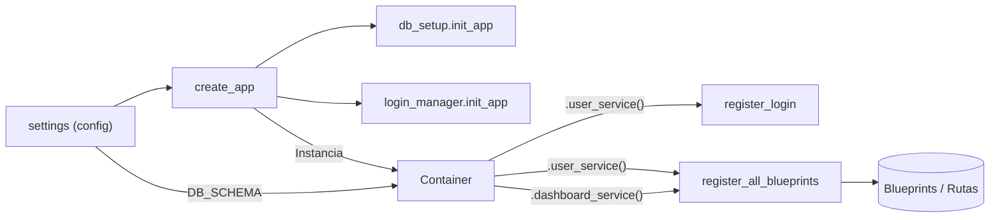
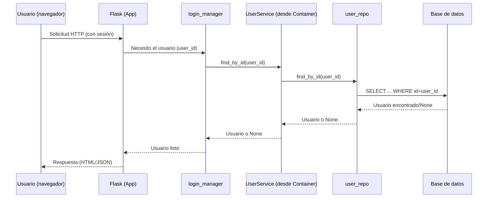
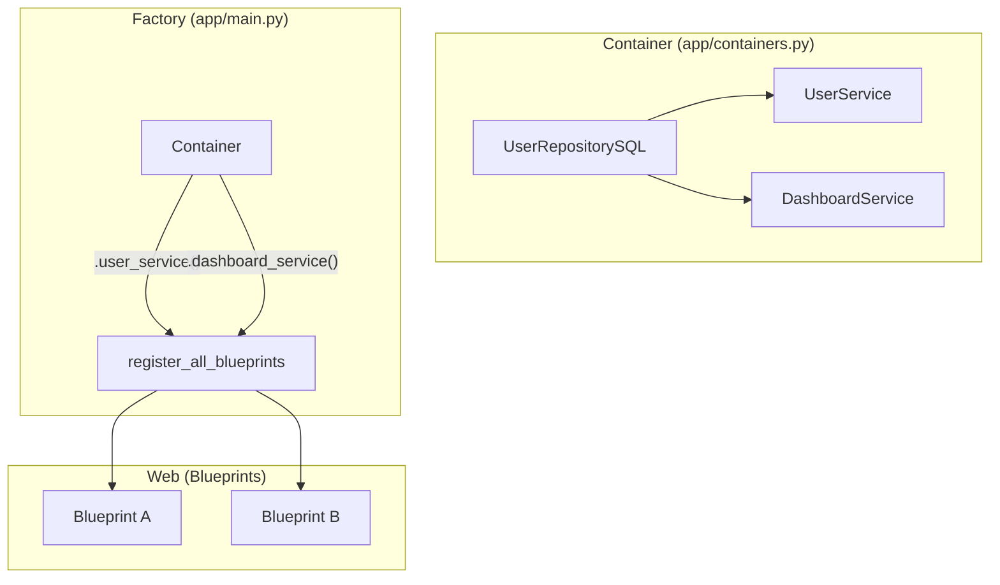

# Documentación funcional — Fábrica de la aplicación (`app/main.py`)

> Archivo: `app/main.py`
> Framework: Flask (aplicaciones web en Python)
> Patrón: **Application Factory** (una función que construye y configura la app)

-----

## Introducción

Este módulo crea y configura la **aplicación web**. Piensa en él como la “línea de ensamblaje” que:

  * Carga la **configuración** (claves, URLs, opciones).
  * Inicializa **extensiones** (sesiones de usuario, base de datos).
  * Prepara el **Contenedor de Inyección de Dependencias (DI)**.
  * Conecta las **rutas** (páginas/endpoints) a la aplicación.
  * Obtiene los **servicios** (lógica de negocio) del contenedor y los inyecta donde se necesiten.

¿Por qué es importante?
Porque centraliza todo lo necesario para que la app **arranque** correctamente y sea fácil de **probar, desplegar y mantener**.

-----

## Uso (paso a paso y ejemplos)

### 1\) Arrancar en local con Flask CLI

Con el patrón *factory*, Flask necesita saber **cómo construir** la app:

**Linux/macOS**

```bash
export FLASK_APP="app.main:create_app"
export FLASK_ENV=development   # opcional: recarga automática y debug
flask run
```

**Windows (PowerShell)**

```powershell
$env:FLASK_APP="app.main:create_app"
$env:FLASK_ENV="development"   # opcional
flask run
```

> Esto levantará la app en `http://127.0.0.1:5000`.

### 2\) Usar un servidor de producción (ejemplo con Gunicorn)

```bash
gunicorn "app.main:create_app()"
```

### 3\) Personalizar la configuración

Si necesitas otra configuración (por ejemplo, para pruebas), pásala como parámetro:

```python
from app.main import create_app
from my_custom_config import TestSettings

app = create_app(config=TestSettings)
```

-----

## Componentes principales

  * **`create_app(config=settings)`**
    Construye la app Flask y aplica la configuración (`app.config.from_object(config)`).

  * **Configuración (`settings`)**
    Objeto con variables de entorno/ajustes (por ejemplo, cadena de conexión a BD, claves secretas, esquema por defecto).

  * **Base de datos (`db_setup.init_app(app)`)**
    Inicializa la capa de base de datos con la configuración activa de la app.

  * **Gestor de sesión de usuario (`login_manager.init_app(app)`)**
    Habilita el inicio de sesión y la persistencia de usuarios entre peticiones.

  * **Contenedor de Dependencias (`Container`)**
    **NÚCLEO DEL CAMBIO**: Se instancia el `Container` (de `app/containers.py`). Este objeto es ahora la **fuente única** para construir y obtener instancias de servicios (`UserService`, `DashboardService`) y repositorios (`UserRepositorySQL`).

  * **Configuración del Contenedor**
    Se lee el `DB_SCHEMA` desde la configuración de Flask (`app.config`) y se inyecta en el contenedor. Esto permite que el contenedor sepa con qué esquema debe construir los repositorios.

    ```python
    container.config.db_schema.from_value(
        app.config.get('DB_SCHEMA', 'public')
    )
    ```

  * **Persistencia del Contenedor (`app.container = container`)**
    Se almacena la instancia del contenedor en el objeto `app` de Flask. Esto es opcional, pero permite que otras partes de la aplicación (como *middlewares* o rutas que usan `@inject`) accedan al contenedor.

  * **Cargador de usuario (`@login_manager.user_loader`)**
    Función que, dada una **id de usuario**, lo recupera desde el servicio de usuario. Esta lógica se configura a través de `register_login`, que ahora recibe el `user_service` desde el contenedor.

    ```python
    # register_login(app, container.user_service())
    # ...
    # Lógica interna (probablemente en infra.http.auth.py):
    return user_service.find_by_id(int(user_id))
    ```

    > Permite a Flask-Login reconstruir al usuario de la sesión.

  * **Registro de rutas (`register_all_blueprints`)**
    Conecta **todas las rutas (blueprints)** a la aplicación. En lugar de instanciar servicios manualmente, ahora los **solicita** al `container` y los pasa a la función de registro.

-----

## Visuales (diagramas)

### 1\) Arquitectura a alto nivel



### 2\) Flujo de una petición con usuario en sesión



### 3\) Inyección de dependencias para blueprints



-----

## Consideraciones, requisitos y buenas prácticas

  * **Requisitos previos**

      * Python 3.x
      * Dependencias instaladas (Flask, Flask-Login, **dependency-injector**, y la librería de base de datos).
      * Variables de entorno/config adecuadas (clave secreta, conexión a BD, etc.).

  * **Configuración clave**

      * `DB_SCHEMA`: esquema SQL. Este valor se pasa ahora al `Container` en tiempo de ejecución (por defecto: `public`).

  * **Orden de inicialización**

    1.  Crear app y cargar config.
    2.  Inicializar BD (`db_setup`) y `login_manager`.
    3.  Instanciar el `Container`.
    4.  **Inyectar** la configuración en tiempo de ejecución (como `DB_SCHEMA`) en el `container`.
    5.  Registrar `register_login` (obteniendo el servicio del `container`).
    6.  Registrar `register_all_blueprints` (obteniendo los servicios del `container`).

  * **Sesiones y seguridad**

      * Asegura que exista **SECRET\_KEY** en la configuración para sesiones seguras.
      * El `user_loader` (configurado en `register_login`) debe manejar casos de usuario inexistente (devolver `None`).

  * **Errores comunes**

      * *“No module named 'dependency\_injector'”*: Faltan dependencias.
      * *“MissingRequiredConfigOption”* (de dependency-injector): `DB_SCHEMA` (u otra config) se definió como requerida en el `Container` pero no se proveyó en `create_app`.

  * **Pruebas**

      * El patrón factory + DI facilita enormemente las pruebas.
      * Puedes **sobrescribir (override)** los proveedores del contenedor para inyectar *Mocks*.
        ```python
        # En una prueba
        app = create_app(TestSettings)

        with app.container.user_service.override(MockUserService()):
            # ... hacer peticiones de prueba ...
        ```

-----

## Preguntas frecuentes (FAQ)

**1) ¿Qué es una “fábrica” de app?**
Es una función que **construye** la aplicación cada vez que se necesita, en lugar de tener una única instancia global. Esto facilita **pruebas** y **configuraciones** diferentes.

**2) ¿Dónde cambio el esquema de la base de datos?**
En la configuración (variable `DB_SCHEMA`). `main.py` la leerá y la **inyectará** en el `Container`.

**3) ¿Qué pasa si el usuario de sesión ya no existe?**
El `user_loader` (que usa el `user_service`) devolverá `None`, y Flask-Login tratará la sesión como no autenticada.

**4) ¿Cómo agrego nuevas rutas?**
Crea un nuevo *Blueprint*. Si necesita un servicio:

1.  Define el servicio y su repositorio en `app/containers.py`.
2.  En `main.py`, obtén el servicio (`container.new_service()`) y pásalo a `register_all_blueprints`.

**5) ¿Puedo usar otra configuración para pruebas o staging?**
Sí. Pasa un objeto de configuración alternativo a `create_app(config=...)`.

**6) ¿Dónde se inicializa la conexión a la base de datos?**
En `db_setup.init_app(app)`. Este punto conecta la configuración con la capa de datos.

**7) ¿Dónde se crean ahora los `UserService` y `UserRepositorySQL`?**
Ya no se crean manualmente en `main.py`. Se definen como "recetas" en el **contenedor de dependencias** (en `app/containers.py`). `main.py` solo *pide* las instancias al contenedor.

-----

## Glosario breve

  * **Configuración (settings)**: conjunto de variables que controlan el comportamiento de la app.
  * **Extensión**: paquete que añade funciones a Flask (por ejemplo, manejo de usuarios).
  * **Contenedor (Container)**: Objeto (de `dependency-injector`) que gestiona cómo crear y conectar servicios y repositorios (Inyección de Dependencias).
  * **Repositorio**: componente que habla con la base de datos.
  * **Servicio**: capa de negocio que usa repositorios para preparar datos/lógica.
  * **Blueprint**: agrupador de rutas para organizar mejor el código.

-----

## Checklist rápido (puesta en marcha)

  * [ ] Configurar variables (SECRET\_KEY, conexión BD, `DB_SCHEMA`).
  * [ ] Instalar dependencias (`pip install -r requirements.txt`).
  * [ ] Ejecutar migraciones/crear esquema si aplica.
  * [ ] Exportar `FLASK_APP="app.main:create_app"`.
  * [ ] `flask run` o `gunicorn "app.main:create_app()"`.

-----

## Árbol mínimo de carpetas (referencial)

```
app/
├─ main.py
├─ containers.py           <-- NUEVO (define el contenedor)
├─ config/
│  └─ settings.py
├─ extensions.py
├─ api/
│  └─ v1/
│     └─ blueprints.py   (register_all_blueprints)
├─ domain/
│  └─ services/
│     ├─ user_service.py
│     └─ dashboard_service.py
└─ infra/
   └─ db/
      ├─ __init__.py     (db_setup)
      └─ user_repository_sql.py
```