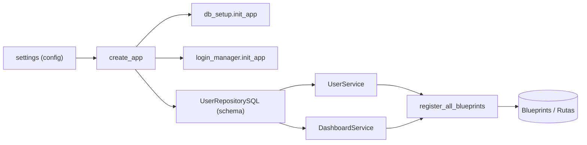
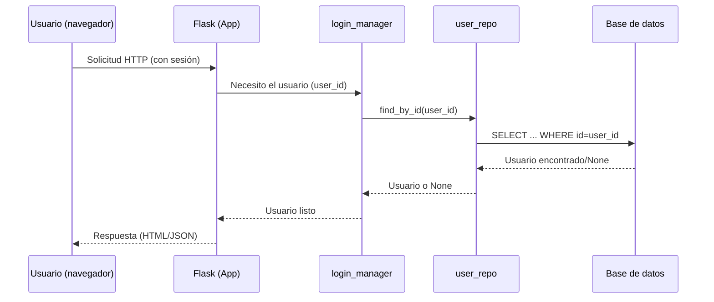
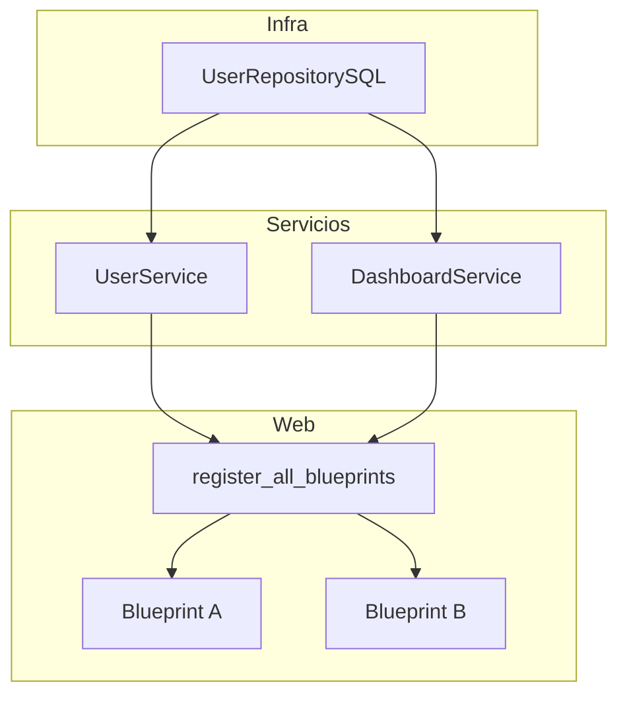

# Documentación funcional — Fábrica de la aplicación (`app/main.py`)

> Archivo: `app/main.py`
> Framework: Flask (aplicaciones web en Python)
> Patrón: **Application Factory** (una función que construye y configura la app)

---

## Introducción

Este módulo crea y configura la **aplicación web**. Piensa en él como la “línea de ensamblaje” que:

* Carga la **configuración** (claves, URLs, opciones).
* Inicializa **extensiones** (sesiones de usuario, base de datos).
* Conecta las **rutas** (páginas/endpoints) a la aplicación.
* Prepara los **servicios** (lógica de negocio) y el **acceso a datos**.

¿Por qué es importante?
Porque centraliza todo lo necesario para que la app **arranque** correctamente y sea fácil de **probar, desplegar y mantener**.

---

## Uso (paso a paso y ejemplos)

### 1) Arrancar en local con Flask CLI

Con el patrón *factory*, Flask necesita saber **cómo construir** la app:

**Linux/macOS**

```bash
export FLASK_APP="app.main:create_app"
export FLASK_ENV=development   # opcional: recarga automática y debug
flask run
```

**Windows (PowerShell)**

```powershell
$env:FLASK_APP="app.main:create_app"
$env:FLASK_ENV="development"   # opcional
flask run
```

> Esto levantará la app en `http://127.0.0.1:5000`.

### 2) Usar un servidor de producción (ejemplo con Gunicorn)

```bash
gunicorn "app.main:create_app()"
```

### 3) Personalizar la configuración

Si necesitas otra configuración (por ejemplo, para pruebas), pásala como parámetro:

```python
from app.main import create_app
from my_custom_config import TestSettings

app = create_app(config=TestSettings)
```

---

## Componentes principales

* **`create_app(config=settings)`**
  Construye la app Flask y aplica la configuración (`app.config.from_object(config)`).

* **Configuración (`settings`)**
  Objeto con variables de entorno/ajustes (por ejemplo, cadena de conexión a BD, claves secretas, esquema por defecto).

* **Base de datos (`db_setup.init_app(app)`)**
  Inicializa la capa de base de datos con la configuración activa de la app.

* **Gestor de sesión de usuario (`login_manager.init_app(app)`)**
  Habilita el inicio de sesión y la persistencia de usuarios entre peticiones.

* **Cargador de usuario (`@login_manager.user_loader`)**
  Función que, dada una **id de usuario**, lo recupera desde la base de datos:

  ```python
  return user_repo.find_by_id(int(user_id))
  ```

  > Permite a Flask-Login reconstruir al usuario de la sesión.

* **Repositorio de usuarios (`UserRepositorySQL`)**
  Accede a la BD bajo un **esquema** configurable (`DB_SCHEMA`, por defecto `public`).

* **Servicios de dominio**

  * `UserService(user_repo)`: lógica relacionada a usuarios.
  * `DashboardService(user_repo)`: prepara datos para tableros/pantallas.

* **Registro de rutas (`register_all_blueprints`)**
  Conecta **todas las rutas (blueprints)** a la aplicación, inyectándoles los servicios necesarios.

---

## Visuales (diagramas)

### 1) Arquitectura a alto nivel



### 2) Flujo de una petición con usuario en sesión



### 3) Inyección de dependencias para blueprints



---

## Consideraciones, requisitos y buenas prácticas

* **Requisitos previos**

  * Python 3.x
  * Dependencias instaladas (Flask, Flask-Login y la librería de base de datos utilizada por `infra.db`).
  * Variables de entorno/config adecuadas (clave secreta, conexión a BD, etc.).

* **Configuración clave**

  * `DB_SCHEMA`: esquema SQL usado por el repositorio (por defecto: `public`).

* **Orden de inicialización**

  1. Crear app y cargar config.
  2. Inicializar BD y `login_manager`.
  3. Instanciar repositorios y servicios.
  4. Registrar blueprints.

* **Sesiones y seguridad**

  * Asegura que exista **SECRET\_KEY** en la configuración para sesiones seguras.
  * El `user_loader` debe manejar casos de usuario inexistente (devolver `None`).

* **Errores comunes**

  * *“No module named …”*: verifica rutas de import y que el proyecto esté en el `PYTHONPATH`.
  * *Conexión a BD fallida*: revisa credenciales/host/puerto y que la BD esté disponible.
  * *Esquema inexistente*: crea el esquema o ajusta `DB_SCHEMA`.

* **Pruebas**

  * El patrón factory facilita crear apps aisladas: `app = create_app(TestSettings)`.
  * Puedes usar una BD temporal (por ejemplo, SQLite de test) y `DB_SCHEMA` específico.

---

## Preguntas frecuentes (FAQ)

**1) ¿Qué es una “fábrica” de app?**
Es una función que **construye** la aplicación cada vez que se necesita, en lugar de tener una única instancia global. Esto facilita **pruebas** y **configuraciones** diferentes.

**2) ¿Dónde cambio el esquema de la base de datos?**
En la configuración (variable `DB_SCHEMA`). Si no se define, usa `public`.

**3) ¿Qué pasa si el usuario de sesión ya no existe?**
`user_loader` devolverá `None`, y Flask-Login tratará la sesión como no autenticada.

**4) ¿Cómo agrego nuevas rutas?**
Crea un nuevo *Blueprint* y añádelo en `register_all_blueprints`, inyectando los servicios que necesite.

**5) ¿Puedo usar otra configuración para pruebas o staging?**
Sí. Pasa un objeto de configuración alternativo a `create_app(config=...)`.

**6) ¿Dónde se inicializa la base de datos?**
En `db_setup.init_app(app)`. Este punto conecta la configuración con la capa de datos.

---

## Glosario breve

* **Configuración (settings)**: conjunto de variables que controlan el comportamiento de la app (claves, URLs, flags).
* **Extensión**: paquete que añade funciones a Flask (por ejemplo, manejo de usuarios).
* **Repositorio**: componente que habla con la base de datos.
* **Servicio**: capa de negocio que usa repositorios para preparar datos/lógica.
* **Blueprint**: agrupador de rutas para organizar mejor el código.

---

## Checklist rápido (puesta en marcha)

* [ ] Configurar variables (SECRET\_KEY, conexión BD, `DB_SCHEMA`).
* [ ] Instalar dependencias (`pip install -r requirements.txt`).
* [ ] Ejecutar migraciones/crear esquema si aplica.
* [ ] Exportar `FLASK_APP="app.main:create_app"`.
* [ ] `flask run` o `gunicorn "app.main:create_app()"`.

---

## Árbol mínimo de carpetas (referencial)

```
app/
├─ main.py
├─ config/
│  └─ settings.py
├─ extensions.py
├─ api/
│  └─ v1/
│     └─ blueprints.py   (register_all_blueprints)
├─ domain/
│  └─ services/
│     ├─ user_service.py
│     └─ dashboard_service.py
└─ infra/
   └─ db/
      ├─ __init__.py     (db_setup)
      └─ user_repository_sql.py
```
