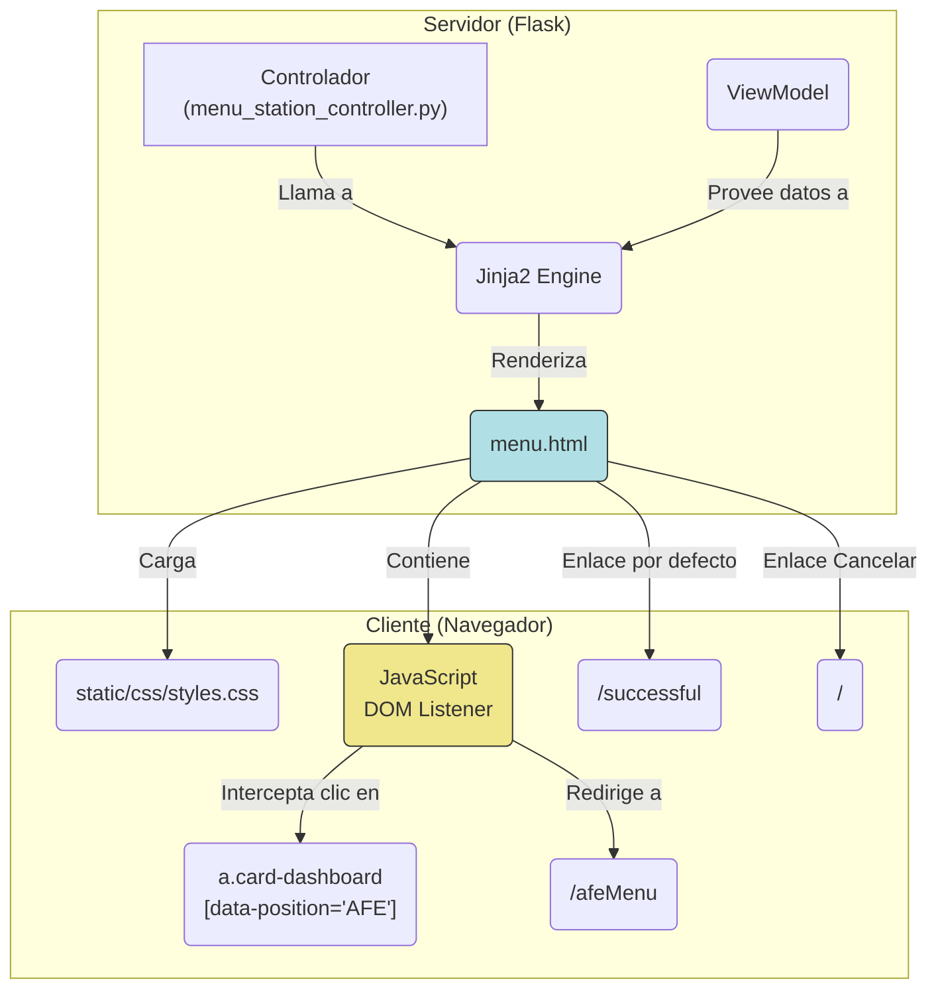

## Documentación Técnica: Plantilla de Vista `templates/menu.html`

### 1\. Visión General y Propósito del Módulo

#### TL;DR Técnico

Este archivo es una plantilla de vista **Jinja2** del lado del servidor que renderiza el menú de selección de estación (`/menuStation`). Recibe un **ViewModel** del controlador que contiene los detalles de la línea y una lista de tarjetas de estación. Incluye lógica **JavaScript del lado del cliente** para interceptar clics en estaciones de tipo "AFE" y redirigir a un menú secundario (`/afeMenu`), en lugar del flujo por defecto (`/successful`).

#### Contexto Arquitectónico

Este módulo es un componente puro de la **Capa de Presentación (Vista)**. Es la "V" en un patrón MVC (Model-View-Controller) o MVP (Model-View-Presenter).

  * **Responsabilidad:** Renderizar el estado de la aplicación (proporcionado por el controlador) en HTML para el usuario final.
  * **Interacciones:**
    1.  **Renderizado por:** Un controlador de Flask (ej. `menu_station_controller.py`) que llama a `render_template('menu.html', ...)`
    2.  **Depende de:** Un archivo de estilos estático (`static/css/styles.css`).
    3.  **Inicia Navegación a:**
          * `/` (Cancelar)
          * `/successful?id=...` (Flujo por defecto)
          * `/afeMenu?side_id=...` (Flujo de excepción para AFE, manejado por JS)

#### Justificación de Diseño

1.  **Renderizado del Lado del Servidor (SSR) con Jinja2:** Se utiliza el motor de plantillas estándar de Flask para construir el HTML dinámicamente en el servidor. Esto permite que los datos (niveles de personal, nombres de estación) se inyecten directamente, asegurando que el cliente reciba una página completa y lista para mostrar.
2.  **Patrón ViewModel:** La plantilla no recibe objetos de dominio crudos. Espera un `view_model` (el contexto de Jinja2) que ha sido explícitamente preparado por una capa anterior (un Presentador o el Controlador). Esto desacopla la lógica de la vista de la lógica de negocio.
3.  **Mejora Progresiva (JavaScript):** El diseño base es funcional sin JavaScript: todos los enlaces de estación apuntan a `/successful?id=...`. Un bloque de JavaScript *mejora* esta funcionalidad interceptando clics *específicos* (donde `data-position === 'AFE'`) y redirigiendo a un flujo alternativo. Este es un diseño robusto, ya que la funcionalidad central (aunque incorrecta para AFE) persiste si el JS falla.
4.  **Atributos `data-`:** El uso de `data-position` y `data-side-id` es una práctica limpia para pasar metadatos del servidor (renderizados en HTML) al JavaScript del lado del cliente, evitando la necesidad de analizar cadenas de texto (como `class` o `href`).

-----

### 2\. Referencia de API y Uso

#### Invocación/Importación

Esta plantilla no se importa. Es invocada por un controlador de Flask mediante `render_template`.

**Ejemplo de Invocación (Controlador de Flask):**

```python
from flask import render_template

@bp.route('/menuStation')
def render_menu_page():
    # 'view_model' es construido por un servicio o presentador
    view_model = {
        "line": "Linea 5",
        "total_employees": 18,
        "total_capacity": 2,
        "tipo": "Estación",
        "cards": [
            {
                "status": True,
                "position_name": "Inyección",
                "sides": [
                    {
                        "side_id": "L5-INJ-A",
                        "class": "status-ok",
                        "side_title": "Lado A",
                        "employee_capacity": 5,
                        "employees_working": 4
                    },
                    # ... más lados ...
                ]
            },
            {
                "status": True,
                "position_name": "AFE",
                "sides": [
                    {
                        "side_id": "L5-AFE-B",
                        "class": "status-full",
                        "side_title": "Lado B",
                        "employee_capacity": 2,
                        "employees_working": 2
                    }
                ]
            }
        ]
    }
    
    # Renderiza esta plantilla pasando el ViewModel
    return render_template("menu.html", **view_model)
```

#### Estructuras de Datos (ViewModel Esperado)

La plantilla espera un objeto de contexto (ViewModel) con la siguiente estructura (descrita en pseudo-TypeScript):

```typescript
interface ViewModel {
    /** El nombre de la línea de producción (ej. "LINEA 1") */
    line: string;

    /** El número total de empleados "Reales" */
    total_employees: number;

    /** El número total "Fuera de estándar" */
    total_capacity: number;

    /** Un prefijo para el nombre de la posición (ej. "Estación") */
    tipo: string;

    /** La lista de tarjetas de estación a renderizar */
    cards: Card[];
}

interface Card {
    /** Si la tarjeta debe ser visible. Si es false, se le aplica la clase .hidden */
    status: boolean;

    /** El nombre de la posición/estación (ej. "Inyección", "AFE") */
    position_name: string;

    /** Lista de lados (opciones) para esta estación */
    sides: Side[];
}

interface Side {
    /** ID único del lado, usado en la URL (ej. "L5-AFE-B") */
    side_id: string | number;

    /** Clase CSS para aplicar estilo al enlace (ej. "status-ok", "status-full") */
    class: string;

    /** Título del lado (ej. "Lado A") */
    side_title: string;

    /** Capacidad estándar de empleados (icono de usuario vacío) */
    employee_capacity: number;

    /** Empleados actualmente trabajando (icono de usuario lleno) */
    employees_working: number;
}
```

-----

### 3\. Análisis de Componentes y Diseño Interno

#### Diagrama de Dependencias



#### Flujo de Control Detallado (JavaScript Client-Side)

Este es el componente de lógica más crítico del archivo.

1.  **Disparador:** El evento `DOMContentLoaded` del navegador se dispara, indicando que el HTML ha sido analizado.
2.  **Selección:** El script selecciona *todos* los elementos `<a>` que tienen la clase `.card-dashboard` (es decir, todos los enlaces de selección de lado).
3.  **Asignación:** Itera sobre cada enlace (`btn`) y le asigna un `click` event listener.
4.  **Ejecución (Clic de Usuario):** Un usuario hace clic en uno de los enlaces `btn`.
5.  **Intercepción:** El *listener* se activa *antes* de que el navegador navegue.
6.  **Inspección de Datos:** El *listener* lee el valor de `btn.dataset.position` (ej. "AFE", "Inyección").
7.  **Condición de Bifurcación:** El valor se limpia (`trim()`, `toUpperCase()`) y se compara con la cadena codificada `"AFE"`.
8.  **Flujo A (La condición es `true`, es "AFE"):**
    a.  `e.preventDefault()`: Se cancela la acción por defecto del navegador (la navegación al `href` original de `/successful?id=...`).
    b.  `window.location.href = ...`: Se inicia una nueva navegación manual a `/afeMenu`, pasando el `side_id` (leído de `btn.dataset.sideId`) como un parámetro de consulta.
9.  **Flujo B (La condición es `false`, no es "AFE"):**
    a.  El bloque `if` se omite.
    b.  El *listener* termina.
    c.  El navegador procede con la acción por defecto: navegar al `href` del enlace (ej. `/successful?id=L5-INJ-A`).

-----

### 4\. Métricas Clave y Consideraciones Técnicas

#### Limitaciones Conocidas

1.  **Acoplamiento Lógico del Lado del Cliente:** La lógica de enrutamiento de la aplicación (que AFE va a `/afeMenu` y el resto a `/successful`) está *codificada en el JavaScript de esta plantilla*. Si el nombre de la estación "AFE" cambia en la base de datos (ej. a "AFE-V2"), o si una nueva estación (ej. "QC") también necesita este comportamiento, el *JavaScript en este archivo HTML* debe ser modificado. Esto es un acoplamiento fuerte entre los datos y la lógica de la vista.
2.  **Mantenibilidad de la Lógica de JS:** La lógica está contenida en un bloque `<script>` al final del `<body>`. Para una aplicación más grande, esta lógica debería extraerse a un archivo `.js` estático separado (ej. `static/js/menu.js`) para permitir el *caching* y una mejor organización.
3.  **Accesibilidad (a11y):**
      * Los iconos `<i>` no tienen `aria-hidden="true"`, lo que puede hacer que los lectores de pantalla intenten leerlos ("user", "user").
      * El enlace `<a>` no tiene un `aria-label` descriptivo. Un lector de pantalla leerá "Lado A" y luego "5 4", lo cual es confuso. Un `aria-label` como `"Lado A: 4 de 5 empleados trabajando"` sería mucho más accesible.

#### Requisitos y Entorno

  * **Servidor:** Un entorno Flask con Jinja2 habilitado.
  * **Cliente:** Un navegador web moderno que soporte `DOMContentLoaded`, `dataset`, y `querySelectorAll` (IE 9+ y todos los navegadores modernos).
  * **Dependencias:** El archivo `static/css/styles.css` debe estar disponible en la ruta estática de Flask.

#### Consideraciones de Rendimiento/Escalabilidad

  * **Rendimiento del Servidor:** El rendimiento está dominado por el controlador que obtiene los datos y construye el `ViewModel`. El tiempo de renderizado de Jinja2 para esta plantilla es trivial.
  * **Rendimiento del Cliente:** El impacto del JavaScript es insignificante. El `DOMContentLoaded` se dispara rápidamente. La selección (`querySelectorAll`) y la asignación de *listeners* es O(N) (donde N es el número de enlaces `.card-dashboard`), lo cual será rápido para cualquier número razonable de estaciones. El *listener* de clic es O(1).

-----

### 5\. Desarrollo y Mantenimiento

#### Proceso de Pruebas

Probar este archivo requiere tres niveles de prueba distintos debido a su naturaleza (SSR + JS).

1.  **Pruebas Unitarias (del Controlador):**

      * Probar el *controlador* de Flask que renderiza esta plantilla.
      * **Objetivo:** Asegurar que el `ViewModel` pasado a `render_template` tenga la estructura de datos correcta (ver Sección 2).
      * **Mockear:** Los servicios que construyen el ViewModel.

2.  **Pruebas de Integración (del Servidor):**

      * Usar el `test_client` de Flask para hacer un `GET` a `/menuStation`.
      * **Objetivo:** Confirmar que la plantilla se renderiza sin errores de Jinja2 (código 200) y que el HTML contiene los datos esperados.
      * **Herramientas:** `pytest`, `test_client` de Flask, `BeautifulSoup` o `lxml` para analizar el HTML de la respuesta.
      * **Asserts:**
          * Verificar que `response.data` contenga el `{{line}}`.
          * Verificar que el `href` de un enlace `.card-dashboard[data-position="AFE"]` sea `/successful?id=...` (para confirmar que el HTML base es correcto).
          * Verificar que el `data-position` esté correctamente renderizado.

3.  **Pruebas End-to-End (E2E) (del Cliente):**

      * **NECESARIO** para validar la lógica de JavaScript.
      * **Objetivo:** Confirmar que la bifurcación de navegación del lado del cliente funciona.
      * **Herramientas:** Selenium, Playwright, o Cypress.
      * **Flujo de Prueba:**
        1.  Cargar la página `/menuStation`.
        2.  Localizar un enlace: `a.card-dashboard[data-position="Inyección"]` (o cualquier cosa que no sea AFE).
        3.  Hacer clic en él.
        4.  **Assert:** La URL del navegador es ahora `.../successful?id=...`.
        5.  Navegar de vuelta.
        6.  Localizar un enlace: `a.card-dashboard[data-position="AFE"]`.
        7.  Hacer clic en él.
        8.  **Assert:** La URL del navegador es ahora `.../afeMenu?side_id=...`.

#### Guía de Contribución

  * **Para modificar estilos:** Edite `static/css/styles.css`.
  * **Para añadir un nuevo tipo de estación (ej. "QC") que también redirija a `/afeMenu`:**
      * Modifique el bloque `<script>`.
      * Actualice la condición:
        ```javascript
        const position = btn.dataset.position.trim().toUpperCase();
        if (position === 'AFE' || position === 'QC') {
            // ...
        }
        ```
  * **Refactorización Recomendada (Para desacoplar):** Si más estaciones necesitan redirecciones personalizadas, reemplace `data-position` con un atributo `data-href-override`:
      * **HTML (Jinja2):**
        ```jinja
        <a href="/successful?id={{side.side_id}}"
           class="card-dashboard ..."
           
           data-href-override="/afeMenu?side_id={{side.side_id}}"
           >
        ```
      * **JavaScript:**
        ```javascript
        btn.addEventListener('click', function(e) {
            const overrideHref = btn.dataset.hrefOverride;
            if (overrideHref) {
                e.preventDefault();
                window.location.href = overrideHref;
            }
        });
        ```
      * Este enfoque mueve la lógica de decisión de vuelta al servidor (Jinja2) y hace que el JS sea genérico, lo cual es un diseño mucho más limpio.

#### Notas de Depuración (Debugging)

  * **El enlace "AFE" me lleva a `/successful` (el flujo por defecto):**
    1.  Abra las Herramientas de Desarrollador del navegador (F12).
    2.  Revise la **Consola** en busca de errores de JavaScript.
    3.  Verifique la línea `console.log('data-position:', btn.dataset.position);` (que ya está en el código). Asegúrese de que el valor `data-position` en el HTML renderizado es "AFE" (cuidado con mayúsculas/minúsculas o espacios en blanco, aunque `trim().toUpperCase()` debería manejarlos).
  * **La página se ve sin estilos:**
    1.  Abra las Herramientas de Desarrollador (F12).
    2.  Vaya a la pestaña **Network**.
    3.  Recargue la página (F5).
    4.  Busque `styles.css`. Si muestra un error 404, la ruta en `url_for('static', ...)` es incorrecta o el archivo no existe.
  * **La página falla al cargar (Error 500):**
      * Esto es un error del servidor, no de la plantilla. Probablemente el `ViewModel` no se proporcionó o tiene una estructura incorrecta (ej. `cards` es `None` y el `` falla). Revise los *logs* del servidor Flask.